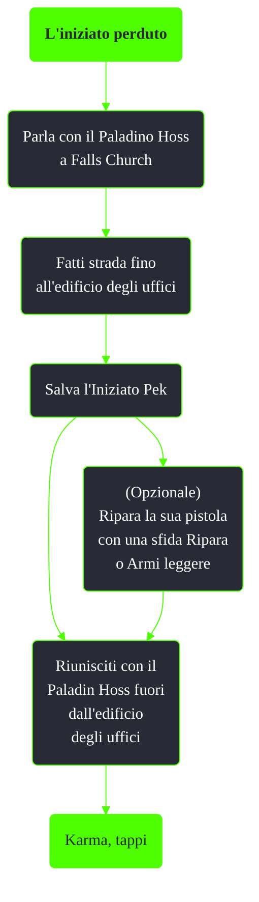

---
# Title, summary, and page position.
linktitle: L'iniziato perduto
summary: ""
weight: 10
icon: message-question
icon_pack: fas

# Page metadata.
title: L'iniziato perduto
date: 2022-11-15
type: book # Do not modify.
commentable: true
tags: "Missioni nascoste di Fallout 3"
hidden: true # Visibile nella sidebar
private: false # Nascosto dalle ricerche
---

*L'iniziato perduto* è una missione nascosta di Fallout 3. E' data dal Paladino Hoss a Falls Church.

Note:
- Il Paladino Hoss e l'Iniziato PEk posso essere uccisi, ma non verrà ottenuta alcuna ricompensa 
- Entrando a Falls Church dalla stazione di Marigold la battaglia fra i membri della Confraternita d'Acciaio e i supermutanti inizierà immediatamente
  - Lasciando l'area e ritornando con un viaggio rapido è possibile che tutti i membri siano già stati uccisi