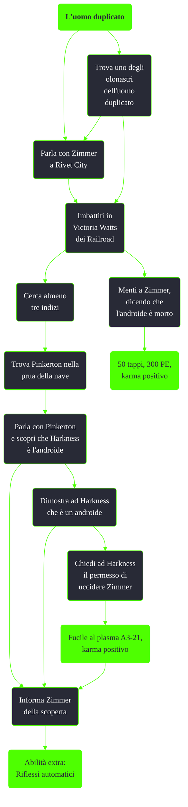

---
# Title, summary, and page position.
linktitle: L'uomo duplicato
summary: ""
weight: 10
icon: messages # message-question per le missioni nascoste
icon_pack: fas

# Page metadata.
title: L'uomo duplicato
date: 2022-11-15
type: book # Do not modify.
commentable: true
tags: "Missioni secondarie di Fallout 3"
hidden: true # Visibile nella sidebar
private: false # Nascosto dalle ricerche
---

**L'uomo duplicato** è una missione secondaria di Fallout 3. È data dal Dottor Zimmer a Rivet City.

<section class="chart-collapse">
<input type="checkbox" name="collapse2" id="handle2">
<h3 class="handle">
<label for="handle2">Clicca per mostrare il diagramma</label>
</h3>

</section>

| Tappe | Stato | Descrizione                                                                                       |
| :---: | :---: | ------------------------------------------------------------------------------------------------- |
|   3   |       | Scopri ulteriori informazioni sull'androide fuggito.                                              |
|   5   |       | Visita Rivet City per scoprire ulteriori informazioni sul robot del Commonwealth.                 |
|  10   |       | Cerca indizi sull'androide scomparso di Zimmer.                                                   |
|  11   |       | [Facoltativo] Scopri cosa potrebbe sapere dell'androide il Dottor Preston di Rivet City.          |
|  15   |       | Continua cercare indizi sull'identità dell'androide OPPURE informa Zimmer che l'androide è morto. |
|  20   |       | Scopri cosa sa dell'androide Pinkerton di Rivet City.                                             |
|  100  |       | Fai rapporto a Zimmer OPPURE metti Harkness in guardia contro Zimmer.                             |
| 200 |   :white_check_mark:    |   <Non visibile al giocatore>                                                                                                |

**Note**:
- È possibile trovare gli indizi in giro per tutta la mappa 
  - Rapporti medici
    - Dottor Banfield, Torre Tenpenny
    - Dott. Church, Megaton
    - Dottor Barrows, Inferi
    - Cutter, Paradise Falls
    - Lucy, Little Lamplight
    - Dottor Preston, Rivet City
    - Red, Big Town
  - Rapporti tecnici
    - Knick Knack, Little Lamplight
    - Moira Brown, Megaton
    - Seagrave Holmes, Rivet City
    - Scriba Bowditch, Cittadella
    - Winthrop, Inferi
  - Rapporti degli schiavisti
    - Eulogy Jones, Paradise Falls
    - Grouse, Paradise Falls
    - Sorella, Paradise Falls/Rivet City
  - Rapporti dei simpatizzanti
    - Manya Vargas, Megaton
    - Padre Clifford, Rivet City
    - Herbert Dashwood, Torre Tenpenny
    - Tulip, Inferi
- È possibile ottenere l'arma unica di Harkness e l'abilità extra da Zimmer semplicemente rivelando ad Harkness che è un androide e, prima di selezionare qualsiasi altro dialogo, offrirci di uccidere Zimmer dicendo "Cosa farai con Zimmer? È da lui che stai scappando." e "A dire il vero, speravo che mi avresti permesso di ucciderlo.". 
  - In questo modo Harkness ci consegnerà l'arma e, una volta raggiunto Zimmer, invece di ucciderlo subito sarà possibile rivelargli l'identità dell'androide e ottenere l'abilità extra, finendo la missione. 
  - È poi ancora possibile scegliere se uccidere Zimmer o lasciare che resetti e porti via Harkness
- Una volta che Zimmer lascerà Rivet City, sparirà dal gioco
- Per entrare nella prua della nave è necessario attraversare una porta a tenuta stagna che risulta sommersa

