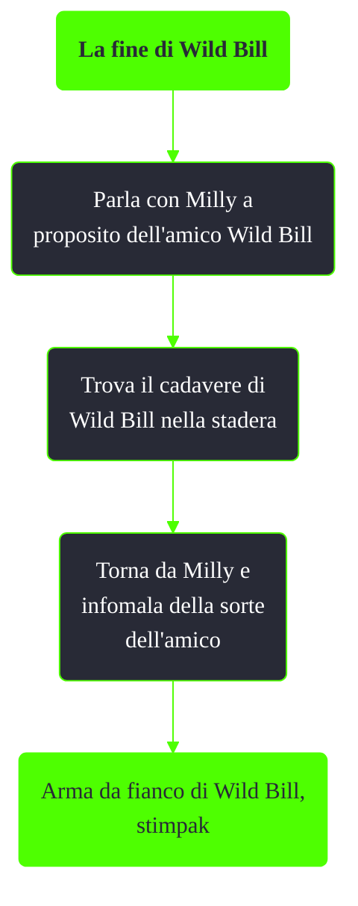

---
# Title, summary, and page position.
linktitle: La fine di Wild Bill
summary: ""
weight: 10
icon: message-question
icon_pack: fas

# Page metadata.
title: La fine di Wild Bill
date: 2022-11-15
type: book # Do not modify.
commentable: true
tags: "Missioni del Pitt"
hidden: true # Visibile nella sidebar
private: false # Nascosto dalle ricerche
---

*La fine di Wild Bill* è una missione nascosta del DLC *The Pitt* di Fallout 3. È data da Milly alla periferia del Pitt.

Note:
- Se si segue la missione nascosta *Operaio del laminatoio* è impossibile non notare il corpo di Wild Bill, essendo esso vicino ad alcune delle barre d'acciaio
