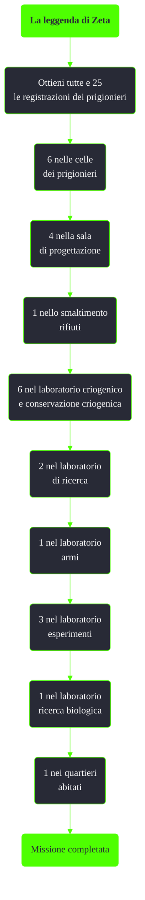

---
# Title, summary, and page position.
linktitle: La leggenda di Zeta
summary: ""
weight: 10
icon: message-question
icon_pack: fas

# Page metadata.
title: La leggenda di Zeta
date: 2022-11-15
type: book # Do not modify.
commentable: true
tags: "Missioni di Mothership Zeta"
hidden: true # Visibile nella sidebar
private: false # Nascosto dalle ricerche
---

*La leggenda di Zeta* è una missione nascosta del DLC *Mothership Zeta* di Fallout 3. È data non appena veniamo teletrasportati sulla nave aliena.

**Riassunto**:
1. Ottieni tutte e 25 le registrazioni dei prigionieri
   - 6 nelle celle dei prigionieri
   - 4 nella sala di progettazione
   - 1 nello smaltimento rifiuti
   - 6 nel laboratorio criogenico e conservazione criogenica
   - 2 nel laboratorio di ricerca
   - 1 nel laboratorio armi
   - 3 nel laboratorio esperimenti
   - 1 nel laboratorio ricerca biologica
   - 1 nei quartieri abitati
2.  Ricompensa: **Trofeo**

<section class="chart-collapse">
<input type="checkbox" name="collapse2" id="handle2">
<h3 class="handle">
<label for="handle2">Clicca per mostrare il diagramma</label>
</h3>

</section>

| Mappa 1                                          | Mappa 2                                           |
| ------------------------------------------------ | ------------------------------------------------- |
| | |

| Immagine                                                                     | N. registraz. | Luogo                    |
| ---------------------------------------------------------------------------- | :-----------: | ------------------------ |
|      |  14, 15, 22   | Celle dei prigionieri    |
|      |   3, 1, 12    | Celle dei prigionieri    |
|  |  5, 6, 7, 8   | Sala di progettazione    |
|     |      19       | Smaltimento rifiuti      |
|            |       2       | Laboratorio criogenico   |
|            |       4       | Laboratorio criogenico   |
|    |    11, 17     | Laboratorio criogenico   |
|           |      16       | Conservazione criogenica |
|           |      25       | Conservazione criogenica |
|       |      13       | Laboratorio di ricerca   |
|       |      21       | Laboratorio di ricerca   |
|        |      24       | Laboratorio armi         |
|            |      20       | Laboratorio esperimenti  |
|             |       9       | Laboratorio esperimenti  |
|            |      10       | Laboratorio esperimenti  |
|       |      18       | Lab. ricerca biologica   |
|    |      23       | Quartieri abitati        |

**Note**:
- Le porte vengono sigillate una volta che si attraversa la porta rotonda con l'ologramma conico, che porta alla passeggiata nello spazio, e sarà impossibile tornare indietro

