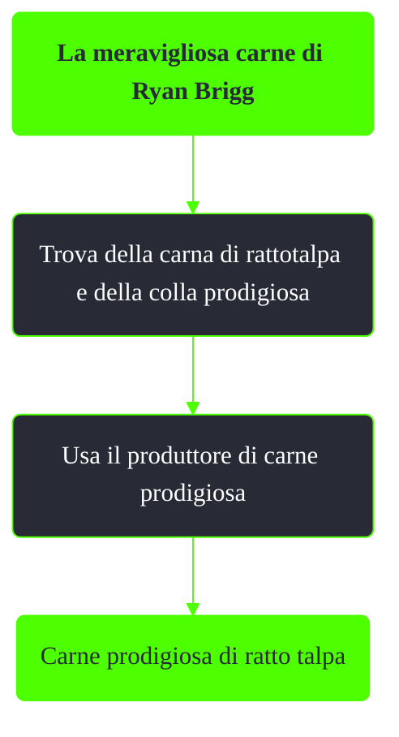

---
# Title, summary, and page position.
linktitle: La meravigliosa carne di Ryan Brigg
summary: ""
weight: 10
icon: message-question
icon_pack: fas

# Page metadata.
title: La meravigliosa carne di Ryan Brigg
date: 2022-11-15
type: book # Do not modify.
commentable: true
tags: "Missioni nascoste di Fallout 3"
hidden: true # Visibile nella sidebar
private: false # Nascosto dalle ricerche
---

*La meravigliosa carne di Ryan Brigg* è una missione nascosta e ripetibile di Fallout 3. È data da Ryan Brigg nei Tunnel di Jury St.

