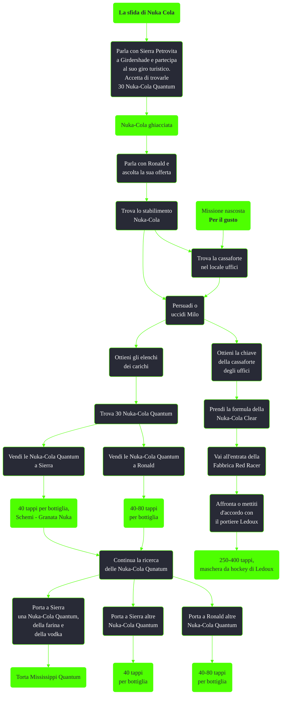

---
# Title, summary, and page position.
linktitle: La sfida di Nuka Cola
summary: ""
weight: 10
icon: messages # message-question per le missioni nascoste
icon_pack: fas

# Page metadata.
title: La sfida di Nuka Cola
date: 2022-11-15
type: book # Do not modify.
commentable: true
tags: "Missioni secondarie di Fallout 3"
hidden: true # Visibile nella sidebar
private: false # Nascosto dalle ricerche
---

*La sfida di Nuka Cola* è una missione secondaria di Fallout 3. È data da Sierra Petrovita a Girdershade.

| Tappe |       Stato        | Descrizione                                                                              |
| :---: | :----------------: | ---------------------------------------------------------------------------------------- |
|  10   |                    | Fai il giro turistico della Nuka Cola di Sierra.                                         |
|  15   |                    | Parla con Sierra Petrovita                                                               |
|  20   |                    | (Facoltativo) Trova le rovine della struttura di imbottigliamento della Nuka Cola.       |
|  30   |                    | (Facoltativo) Recupera gli elenchi dei carichi per la logistica della Nuka Cola Quantum. |
|  40   |  :white_check_mark:                  | Recupera 30 bottiglie di Nuka Cola Quantum e portale a Sierra Petrovita                  |
|  45   | :white_check_mark: | (Facoltativo) Recupera 30 bottiglie di Nuka Cola Quantum e portale a Ronald Laren        |

Note:
- È possibile ottenere la maschera da hockey di Ledoux solo durante questa missione
  - Non è possibile ottenerla se si ha già consegnato le 30 Nuka-Cola Quantum a Sierra
- Con l'abilità extra Chimico quantico (liv. 22) è possibile ottenere una Nuka-Cola Quantum ogni dieci bottiglie di Nuka-Cola normali
  - Le Nuka-Cola non possono essere convertite
- Con tre **Schemi - Granata Nuka** è possibile fabbricare il triplo di granate nuka usando la stessa quantità di ingredienti
- Con il giusto livello di Eloquenza è possibile vendere soltanto 29 Nuka-Cola Quantum a Ronald e poi 30 a Sierra per ottenere un totale di 2320 tappi