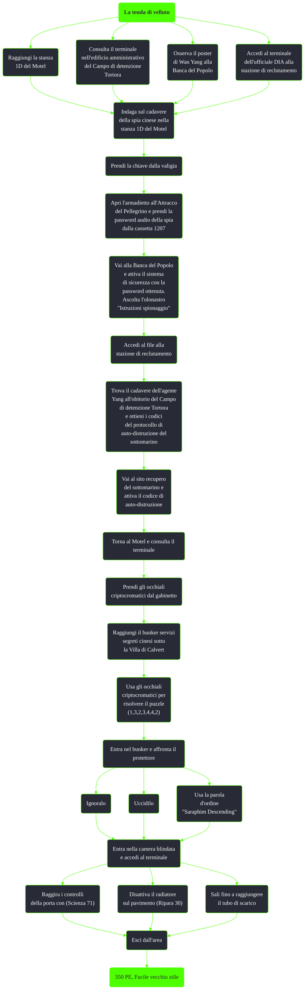

---
# Title, summary, and page position.
linktitle: La tenda di velluto
summary: ""
weight: 10
icon: message-question
icon_pack: fas

# Page metadata.
title: La tenda di velluto
date: 2022-11-15
type: book # Do not modify.
commentable: true
tags: "Missioni di Point Lookout"
hidden: true # Visibile nella sidebar
private: false # Nascosto dalle ricerche
---

*La tenda di velluto* è una missione secondaria del DLC *Point Lookout* di Fallout 3. È data dal terminale nella stanza 1D al Motel.

**Riassunto**:
1. È possibile ottenere la missione in diversi modi
   - Raggiungi la stanza 1D del Motel
   - Consulta il terminale nell'edificio amministrativo del Campo di detenzione Tortora
   - Osserva il poster di Wan Yang alla Banca del Popolo
   - Accedi al terminale dell'ufficiale DIA alla stazione di reclutamento
2. Indaga sul cadavere della spia cinese nella stanza 1D del Motel
3. Prendi la chiave dalla valigia
4. Apri l'armadietto all'Attracco del Pellegrino e prendi la password audio della spia dalla cassetta 1207
5. Vai alla Banca del Popolo e attiva il sistema di sicurezza con la password ottenuta. Ascolta l'olonastro "Istruzioni spionaggio"
6. Accedi al file alla stazione di reclutamento
7. Trova il cadavere dell'agente Yang all'obitorio del Campo di detenzione Tortora e ottieni i codici del protocollo di auto-distruzione del sottomarino
8. Vai al sito recupero del sottomarino e attiva il codice di auto-distruzione
9. Torna al Motel e consulta il terminale
10. Prendi gli occhiali criptocromatici dal gabinetto
11. Raggiungi il bunker servizi segreti cinesi sotto la Villa di Calvert
12. Usa gli occhiali criptocromatici per risolvere il puzzle (1,3,2,3,4,4,2)
13. Entra nel bunker e affronta il protettore
    1.  Ignoralo
    2.  Uccidilo
    3.  Usa la parola d'ordine "Saraphim Descending"
14. Entra nella camera blindata e accedi al terminale
    1.  **Scienza 71**: raggira i controlli della porta con 
    2.  **Ripara 30**: disattiva il radiatore sul pavimento 
    3.  Sali fino a raggiungere il tubo di scarico
15. Esci dall'area
16. Ricompensa: **350 PE**, **Fucile vecchio stile**

<section class="chart-collapse">
<input type="checkbox" name="collapse2" id="handle2">
<h3 class="handle">
<label for="handle2">Clicca per mostrare il diagramma</label>
</h3>

</section>

| Tappe |       Stato        | Descrizione                                                                                              |
|:-----:|:------------------:| -------------------------------------------------------------------------------------------------------- |
|   5   |                    | Indaga sulla spia nella stanza del Motel 1D.                                                             |
|   9   |                    | Recupera la chiave dell'armadietto della spia cinese morta dalla stanza del Motel 1D.                    |
|  10   |                    | Recupera le istruzioni della spia cinese morta dall'armadietto a Point Lookout.                          |
|  30   |                    | Usa l'olonastro come password per accedere alla cassetta di sicurezza 1207 della banca di Point Lookout. |
|  31   |                    | Ascolta l'olonastro con le istruzioni per la spia.                                                       |
|  40   |                    | Cerca delle prove sulla tragica morte dell'agente Yang.                                                  |
|  45   |                    | Investiga sulla morte dell'agente Yang al campo di detenzione Tortora.                                   |
|  60   |                    | Attiva il protocollo di auto-distruzione del sottomarino cinese.                                         |
|  61   |                    | Conferma l'auto-distruzione del sottomarino attivando l'Esito-certo.                                     |
|  62   |                    | Allontanati dal sottomarino prima che esploda!                                                           |
|  70   |                    | Torna al terminale del bunker nel Motel per ricevere ulteriori istruzioni.                               |
|  71   |                    | Recupera gli occhiali criptocromatici dal serbatoio dello scarico nella stanza del Motel 1D.             |
|  80   |                    | Usa gli occhiali criptocromatici e la nota della sequenza per accedere al bunker della spia.             |
|  81   |                    | Vai nel bunker dei servizi segreti e trova i dettagli sull'estrazione.                                   |
|  90   | :white_check_mark: | Scampa i pericoli del doppio gioco!                                                                      |

