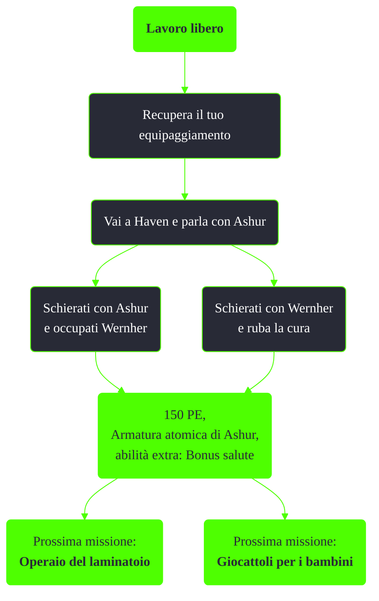

---
# Title, summary, and page position.
linktitle: Lavoro libero
summary: ""
weight: 10
icon: message-question
icon_pack: fas

# Page metadata.
title: Lavoro libero
date: 2022-11-15
type: book # Do not modify.
commentable: true
tags: "Missioni del Pitt"
hidden: true # Visibile nella sidebar
private: false # Nascosto dalle ricerche
---

*Lavoro libero* è una missione del DLC *The Pitt* di Fallout 3. È data da Krenshaw al Pitt.

**Riassunto**:
1. Recupera il tuo equipaggiamento
2. Vai a Haven e parla con Ashur
   - Schierati con Ashur e occupati Wernher
   - Schierati con Wernher e ruba la cura
3. Ricompensa: **150 PE**, **Armatura atomica di Ashur**, **abilità extra: Bonus salute**
4. Prossime mission: *Operaio del laminatoio*, *Giocattoli per i bambini*

<section class="chart-collapse">
<input type="checkbox" name="collapse2" id="handle2">
<h3 class="handle">
<label for="handle2">Clicca per mostrare il diagramma</label>
</h3>

</section>

| Tappe |       Stato        | Descrizione                                                                 |
|:-----:|:------------------:| --------------------------------------------------------------------------- |
|   1   |                    | Recupera la tua roba.                                                       |
|   5   |                    | Vai nel centro e raggiungi Haven.                                           |
|  10   |                    | Vai a Haven e incontra Ashur.                                               |
|  20   |                    | Trova la cura nel palazzo di Ashur.                                         |
|  30   |                    | Rapisci la bambina e scappa OPPURE vattene senza la bambina.                |
|  32   |                    | Vattene senza la bambina.                                                   |
|  37   |                    | Rapisci la bambina e scappa.                                                |
|  50   |                    | Ferma Wernher.                                                              |
|  55   |                    | Trova Wernher.                                                              |
|  70   |                    | Vai da Midea e scopri dove si trova Wernher.                                |
|  71   |                    | Perquisisci Midea o la sua stanza e cerca indizi che ti portino da Wernher. |
|  75   |                    | Riporta la bambina da Midea.                                                | 
|  90   |                    | Consegna la bambina a Wernher OPPURE fermalo.                               |
|  92   |                    | Ferma Wernher.                                                              |
|  97   |                    | Consegna la bambina a Wernher.                                              |
|  100  |                    | Riporta la bambina a casa.                                                  |
|  105  |                    | Taglia l'elettricità alle luci del centro.                                  |
|  190  |                    | Torna da Ashur.                                                             |
|  195  | :white_check_mark: | Scappa verso Market Square.                                                 |

**Note**:
- Scegliendo di schierarsi con Ashur è ancora possibile uccidere gli schiavi, guadagnando però karma negativo
- Terminata la missione a favore degli schiavi sarà possibile consegnare a Midea degli orsacchiotti (vedi *Giocattoli per i bambini*)

