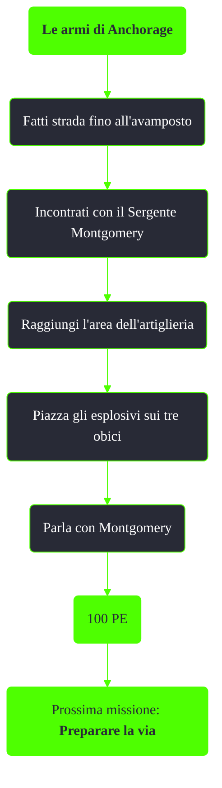

---
# Title, summary, and page position.
linktitle: Le armi di Anchorage
summary: ""
weight: 10
icon: message-question
icon_pack: fas

# Page metadata.
title: Le armi di Anchorage
date: 2022-11-15
type: book # Do not modify.
commentable: true
tags: "Missioni di Operation: Anchorage"
hidden: true # Visibile nella sidebar
private: false # Nascosto dalle ricerche
---

*Le armi di Anchorage* è una missione del DLC *Operation: Anchorage* di Fallout 3. È data dal Generale Chase durante la simulazione della liberazione di Anchorage.

<section class="chart-collapse">
<input type="checkbox" name="collapse2" id="handle2">
<h3 class="handle">
<label for="handle2">Clicca per mostrare il diagramma</label>
</h3>

</section>

| Tappe |       Stato        | Descrizione |
| :---: | :----------------: | ----------- |
|  10     |                    |  Infiltrati nel sito dell'artiglieria cinese.           |
|  20     |                    | Vai dal sergente Montgomery.            |
|   30    |                    | Distruggi le tre armi di artiglieria.            |
|    40   |  :white_check_mark:                  |  Fai rapporto al generale Chase al Quartier Generale da campo degli USA.           |

**Note**:
- Terminata questa missione non sarà più possibile ottenere le prime quattro valigette per *Operazioni sotto copertura*

