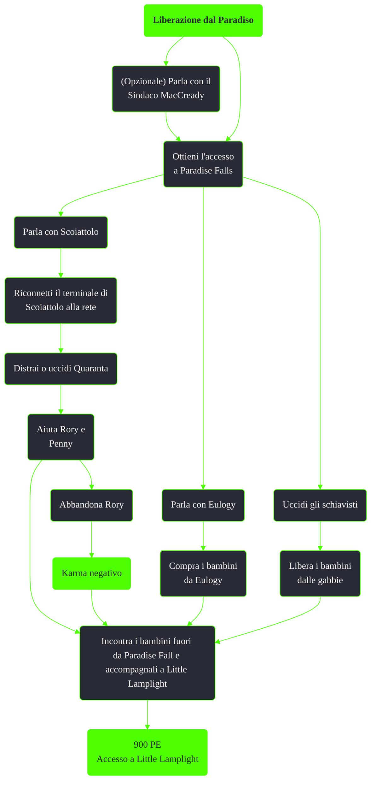

---
# Title, summary, and page position.
linktitle: Liberazione dal Paradiso
summary: ""
weight: 40
icon: messages # message-question per le missioni nascoste
icon_pack: fas

# Page metadata.
title: Liberazione dal Paradiso
date: 2022-11-15
type: book # Do not modify.
commentable: true
tags: "Missioni secondarie di Fallout 3"
hidden: true # Visibile nella sidebar
private: false # Nascosto dalle ricerche
---

*Liberazione dal Paradiso* è una missione secondaria data dal Sindaco MacCready a Little Lamplight o da Sammy a Paradise Falls. A seconda delle scelte nelle altre missioni correlate diventa essenziale superarla per progredire nella trama principale.

**Riassunto**:
1. (Opzionale) Parla con il Sindaco MacCready
2. Ottieni l'accesso a Paradise Falls
   - Parla con Scoiattolo
      1. Riconnetti il terminale di Scoiattolo alla rete  
      2. Distrai o uccidi Quaranta
      3. Aiuta Rory e Penny; se abbandoni Rory: **karma negativo**
   - Parla con Eulogy e compra i bambini
   - Uccidi gli schiavisti e libera i bambini dalle gabbie
3. Incontra i bambini fuori da Paradise Fall e accompagnali a Little Lamplight
4. Ricompensa: **900 PE**, accesso a Little Lamplight

<section class="chart-collapse">
<input type="checkbox" name="collapse2" id="handle2">
<h3 class="handle">
<label for="handle2">Clicca per mostrare il diagramma</label>
</h3>

</section>

| Tappe |       Stato        | Descrizione                                                                     |
| :---: | :----------------: | ------------------------------------------------------------------------------- |
|  10   |                    | Ottieni l'accesso a Paradise Falls.                                             |
|  15   |                    | Trova e parla con gli abitanti di Lamplight rapiti.                             |
|  20   |                    | Connetti il computer del grande magazzino alla rete protetta di Paradise Falls. |
|  30   |                    | Avvisa Squirrel che il computer adesso è connesso alla rete.                    |
|  40   |                    | Fai in modo che Quaranta sia lontano dal recinto degli schiavi.                 |
|  45   |                    | Avvisa Squirrel che la guardia è stata distratta.                               |
|  50   |                    | Parla con Penny e convincila a lasciare Paradise Falls.                         |
|  60   |                    | Trova un sistema per far uscire Rory Maclaren dalla scatola.                    |
|  70   |                    | Parla con Penny e dille di lasciare Paradise Falls.                             |
|  80   |                    | Incontra i bambini a sud ovest di Paradise Falls.                               |
|  90   |                    | Accompagna i bambini fuori da Paradise Falls.                                   |
|  150  |                    | Raggiungi il recinto degli schiavi e parla con i bambini.                       |
|  155  |                    | Sblocca il cancello del recinto degli schiavi.                                  |
|  160  |                    | Avvisa i bambini di fuggire da Paradise Falls.                                  |
|  170  | :white_check_mark: | Incontra i bambini a sud ovest di Paradise Falls.                               |

**Note**:
- È possibile completare questa missione anche senza aver ottenuta in precedenza da MacCready: è sufficiente uccidere gli schiavisti e liberare i bambini dalle gabbie
- Con l'abilità extra Bambino dentro o superando una sfida Eloquenza con MacCready, è possibile saltare completamente questa missione

