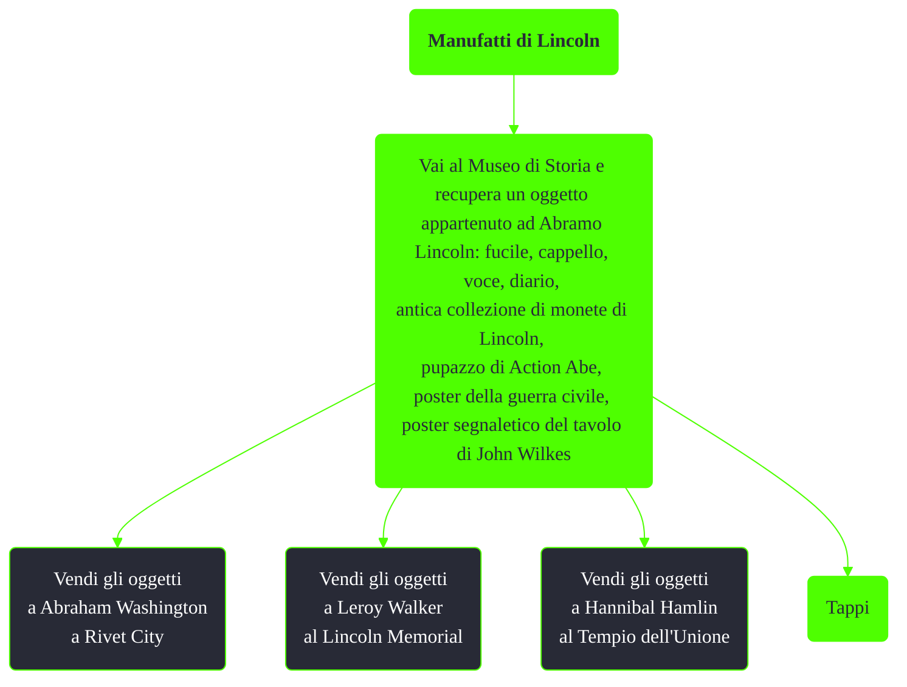

---
# Title, summary, and page position.
linktitle: Manufatti di Lincoln
summary: ""
weight: 10
icon: message-question
icon_pack: fas

# Page metadata.
title: Manufatti di Lincoln
date: 2022-11-15
type: book # Do not modify.
commentable: true
tags: "Missioni nascoste di Fallout 3"
hidden: true # Visibile nella sidebar
private: false # Nascosto dalle ricerche
---

*Manufatti di Lincoln* è una missione nascosta di Fallout 3. È data da Abraham Washington a Rivet City, Leroy Walker al Lincoln Memorial o da Hannibal Hamlin al Tempio dell'Unione.

**Riassunto**:
1. Vai al Museo di Storia e recupera un oggetto appartenuto ad Abramo Lincoln
2. Vendi gli oggetti
   - Ad Abraham Washington a Rivet City
   - A Leroy Walker al Lincoln Memorial
   - A Hannibal Hamlin al Tempio dell'Unione
3. Ricompensa: **Tappi**

<section class="chart-collapse">
<input type="checkbox" name="collapse2" id="handle2">
<h3 class="handle">
<label for="handle2">Clicca per mostrare il diagramma</label>
</h3>

</section>

| Oggetto                                      | Hannibal Hamlin            | Leroy Walker    | Abraham Washington |
| -------------------------------------------- | -------------------------- | --------------- | ------------------ |
| Cappello di Lincoln                          | 25 o 50 tappi (ripetibile) | 25 o 50 tappi   | 70 o 140 tappi     |
| Voce di Lincoln                              | 50 o 100 tappi             | 50 o 100 tappi  | 60 o 120 tappi     |
| Pupazzo di Action Abe                        | 10 o 20 tappi              | 10 o 20 tappi   | 10 o 20 tappi      |
| Poster della guerra civile                   | 75 o 150 tappi             | 50 o 100 tappi  | 60 o 120 tappi     |
| Diario di Lincoln                            | 100 o 200 tappi            | 75 o 150 tappi  | 100 o 200 tappi    |
| Antica collezione di monete di Lincoln       | 15 o 30 tappi              | 15 o 30 tappi   | 15 o 30 tappi      |
| Poster segnaletico del tavolo di John Wilkes | 50 o 100 tappi             | 75 o 150 tappi  | 70 o 140 tappi     |
| Poster del Lincoln Memorial                  | nessuna offerta            | 100 o 200 tappi | nessuna offerta    |

**Note**:
- È possibile borseggiare gli oggetti venduti a Hannibal e rivenderli a Abraham Washington, ma senza poter chiedere un prezzo maggiorato
- Dando il poster del Lincoln Memorial a Caleb non sarà più possibile venderlo a Leroy Walker
- La vendita di almeno un oggetto a Leroy garantirà il libero accesso al Lincoln Memorial quando questi è sotto dominio degli schiavisti
- Barattando con Hannibal sarà necessario superare per ogni oggetto un sfida Eloquenza separata

