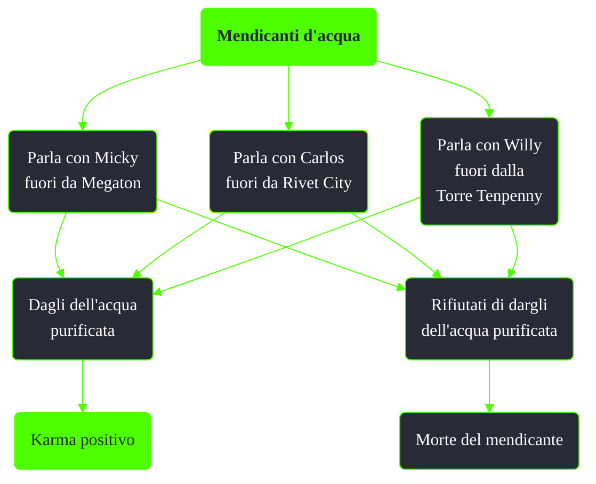

---
# Title, summary, and page position.
linktitle: Mendicanti d'acqua
summary: ""
weight: 10
icon: message-question
icon_pack: fas

# Page metadata.
title: Mendicanti d'acqua
date: 2022-11-15
type: book # Do not modify.
commentable: true
tags: "Missioni nascoste di Fallout 3"
hidden: true # Visibile nella sidebar
private: false # Nascosto dalle ricerche
---

*Mendicanti d'acqua* è una missione nascosta e ripetibile di Fallout 3. È data da Micky fuori da Megaton, Carlos fuori da Rivet City e Willy fuori dalla Torre Tenpenny.

Note:
- Dando loro l'Aqua Pure con il FEV si guadagnerà karma negativo