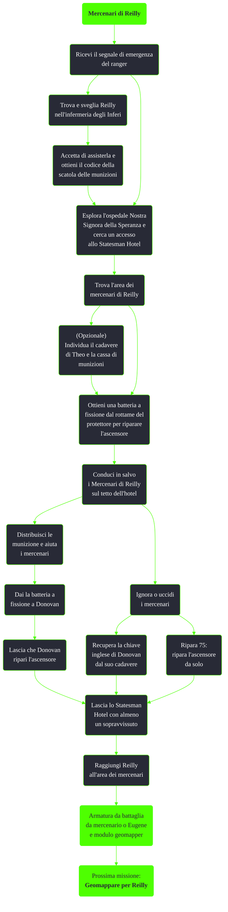

---
# Title, summary, and page position.
linktitle: Mercenari di Reilly
summary: ""
weight: 10
icon: messages # message-question per le missioni nascoste
icon_pack: fas

# Page metadata.
title: Mercenari di Reilly
date: 2022-11-15
type: book # Do not modify.
commentable: true
tags: "Missioni secondarie di Fallout 3"
hidden: true # Visibile nella sidebar
private: false # Nascosto dalle ricerche
---

*Mercenari di Reilly* è una missione secondaria di Fallout 3. È data da Reilly agli Inferi o da Butcher allo Statesman Hotel.

<section class="chart-collapse">
<input type="checkbox" name="collapse2" id="handle2">
<h3 class="handle">
<label for="handle2">Clicca per mostrare il diagramma</label>
</h3>

</section>

| Tappe |       Stato        | Descrizione                                                |
| :---: | :----------------: | ---------------------------------------------------------- |
|   5   |                    | Trova Reilly negli Inferi all'interno del Museo di Storia. |
|  10   |                    | Trova l'Ospedale Nostra Signora della Speranza.            |
|  12   |                    | (Facoltativo) Affrettati verso l'Area dei mercenari.       |
|  15   |                    | (Facoltativo) Trova la cassa di munizioni dei mercenari.   |
|  20   |                    | Trova i Mercenari di Reilly.                               |
|  25   |                    | Trova una batteria a fissione.                             |
|  28   |                    | Dai una batteria a fissione a Donovan.                     |
|  30   |                    | Conduci in salvo i Mercenari di Reilly.                    |
|  40   |                    | Raggiungi l'uscita dello Statesman Hotel.                  |
|  50   | :white_check_mark: | Torna a Reilly all'Area dei mercenari.                     |

**Note**:
- Se si perde la batteria a fissione, l'ascensore diventerà inutilizzabile e sarà impossibile lasciare l'hotel
- Il geomapper è retroattivo e tutti i luoghi  già esplorati verranno conteggiati
- Dopo aver completato *Broken Steel* e ottenuto l'analizzatore di sangue supermutante per la missione nascosta *Confraternita di sangue*, è possibile ottenere 50 tappi e 10 PE per ogni campione di sangue supermutante consegnato al Paladino Tristan. In questa missione è possibile raccoglierne più di 50
- Dopo aver riparato l'ascensore, è possibile lasciare che i supermutanti uccidano Brick per poter ottenere Eugene e l'armatura da battaglia da mercenario senza essere costretti a sceglierne uno come ricompensa finendo la missione
- È possibile uccidere Brick personalmente senza che glia altri mercenari diventino ostili
- Se tutti i mercenari muoiono, non verrà data alcuna ricompensa, nemmeno il modulo del geomapper
- È possibile ottenere sia Eugene che l'armatura da battaglia del mercenario applicando il reverse-pickpocketing a Brick e Donovan

