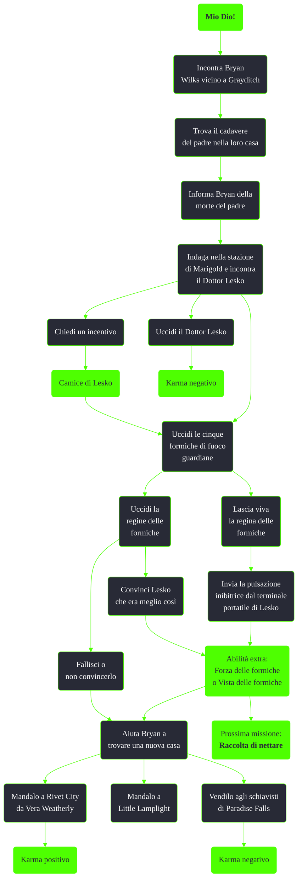

---
# Title, summary, and page position.
linktitle: Mio Dio!
summary: ""
weight: 10
icon: messages # message-question per le missioni nascoste
icon_pack: fas

# Page metadata.
title: Mio Dio!
date: 2022-11-15
type: book # Do not modify.
commentable: true
tags: "Missioni secondarie di Fallout 3"
hidden: true # Visibile nella sidebar
private: false # Nascosto dalle ricerche
---

*Mio Dio!* è una missione secondaria di Fallout 3. È data da Bryan Wilks a Grayditch.

<section class="chart-collapse">
<input type="checkbox" name="collapse2" id="handle2">
<h3 class="handle">
<label for="handle2">Clicca per mostrare il diagramma</label>
</h3>

</section>

| Tappe |       Stato        | Descrizione                                                                                         |
| :---: | :----------------: | --------------------------------------------------------------------------------------------------- |
|  10   |                    | Trova il padre di Bryan Wilks.                                                                      |
|  20   |                    | Porta le cattive notizie a Bryan Wilks.                                                             |
|  30   |                    | Elimina l'origine delle Formiche di fuoco.                                                          |
|  35   |                    | Indaga nella stazione della metropolitana di Marigold ed elimina l'origine delle Formiche di fuoco. |
|  40   |                    | Elimina tutte le cinque guardie del nido dal covo della formica regina.                             |
|  42   |                    | (Facoltativo) Non fare del male alla formica regina.                                                |
|  43   |                    | Invia la pulsazione inibitrice dal terminale portatile di Lesko oppure uccidi la formica regina.    |
|  45   |                    | Torna dal Dottor Lesko.                                                                             |
|  50   |                    | Torna da Bryan Wilks.                                                                               |
|  52   |                    | Trova Bryan Wilks a Grayditch.                                                                      |
|  60   | :white_check_mark: | Trova una casa per Bryan Wilks.                                                                     |

**Note**:
- Assicurati di aver ucciso tutte le formiche guardiane, altrimenti il Dottor Lesko finirà ucciso prima di riuscire a raggiungere il terminale e attivare l'impulso inibitore
- Finita la missione il Dottor Lesko si sposterà nella sua baracca e sarà possibile vendergli i nettari delle formiche di fuoco (40 tappi a campione; missione nascosta *Raccolta di nettare*)

