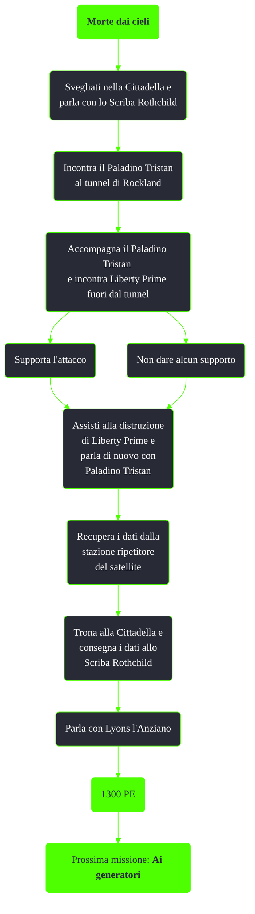

---
# Title, summary, and page position.
linktitle: Morte dai cieli
summary: ""
weight: 10
icon: message-question
icon_pack: fas

# Page metadata.
title: Morte dai cieli
date: 2022-11-15
type: book # Do not modify.
commentable: true
tags: "Missioni di Broken Steel"
hidden: true # Visibile nella sidebar
private: false # Nascosto dalle ricerche
---

*Morte dai cieli* è una missione del DLC *Broken Steel* di Fallout 3. È data dall'Anziano Lyons alla Cittadella.

<section class="chart-collapse">
<input type="checkbox" name="collapse2" id="handle2">
<h3 class="handle">
<label for="handle2">Clicca per mostrare il diagramma</label>
</h3>

</section>

| Tappe |       Stato        | Descrizione                                         |
|:-----:|:------------------:| --------------------------------------------------- |
|  10   |                    | Parla con lo Scriba Rothchild.                      |
|  15   |                    | Incontra il Paladino Tristan al tunnel di Rockland. |
|  20   |                    | Assisti il Paladino Tristan durante l'assalto.      |
|  30   |                    | Recupera i dati dal ripetitore del satellite.       |
|  40   |                    | Consegna i dati allo Scriba Rothchild.              |
|  50   | :white_check_mark: | Fai rapporto a Lyons l'Anziano.                     |

**Note**:
- Usa il comando `player.setstage xx000802 20` nel caso non riuscissi a muoverti dal letto e `player.setstage xx000802 20` nel caso la missione non riuscisse ad avanzare

