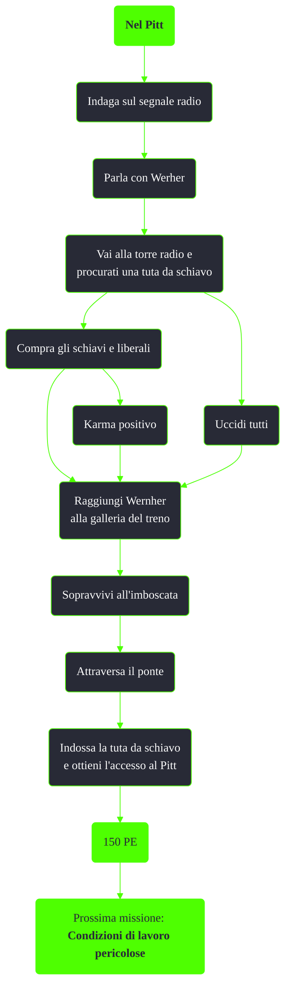

---
# Title, summary, and page position.
linktitle: Nel Pitt
summary: ""
weight: 10
icon: message-question
icon_pack: fas

# Page metadata.
title: Nel Pitt
date: 2022-11-15
type: book # Do not modify.
commentable: true
tags: "Missioni del Pitt"
hidden: true # Visibile nella sidebar
private: false # Nascosto dalle ricerche
---

*Nel Pitt* è una missione del DLC *The Pitt* di Fallout 3. È data da Wernher alla Torre della radio.

**Riassunto**:
1. Indaga sul segnale radio
2. Parla con Werher
3. Vai alla torre radio e procurati una tuta da schiavo
   - Compra gli schiavi e liberali: Karma positivo
   - Uccidi tutti
4. Raggiungi Wernher alla galleria del treno
5. Sopravvivi all'imboscata
6. Attraversa il ponte
7. Indossa la tuta da schiavo
8. Ricompensa: **150 PE**, accesso al Pitt
9. Prossima missione: *Condizioni di lavoro pericolose*

<section class="chart-collapse">
<input type="checkbox" name="collapse2" id="handle2">
<h3 class="handle">
<label for="handle2">Clicca per mostrare il diagramma</label>
</h3>

</section>

| Tappe |       Stato        | Descrizione |
| :---: | :----------------: | ----------- |
| 10      |                    |  Trova la fonte delle trasmissioni radio.           |
| 50      |                    | Acquista dei vestiti da schiavo.            |
| 51      |                    | (Opzionale) Acquista dei vestiti da schiavo.            |
| 90      |                    |  Torna da Wernher.           |
| 100      |                    |   Vai al Pitt.          |
| 200      |  :white_check_mark:                  | Infiltrati nel Pitt.            |

**Note**:
- E' possibile riuscire ad andare al Pitt con tutto il proprio inventario e impedire che questa venga requisito dalla guardia:
	-  Prendi il cadavere di uno degli schiavi che stavano scappando dal Pitt
	- Sposta il tuo inventario in quello dello schiavo
	-  Colloca il cadavere oltre la recinzione
	- Dialoga con la guardia Mex
	- Entra nel Pitt ed esci immediatamente, così da sbloccare il viaggio rapido: nota che, entrare nel Pitt dall'ingresso principale fa perdere tutte le armi di nuovo quindi è necessario usare il viaggio rapido
	- Riprendi le armi dall'inventario dello schiavo
	- Usa il viaggio rapido per andare al Pitt, senza perdere le armi
	- Se la missione principale non progredisce, avvicinati di nuovo all'ingresso del Pitt, senza attraversarlo
- Essere uno schiavista a Paradise Falls non ha effetti sui dialoghi o sugli obiettivi della missione

