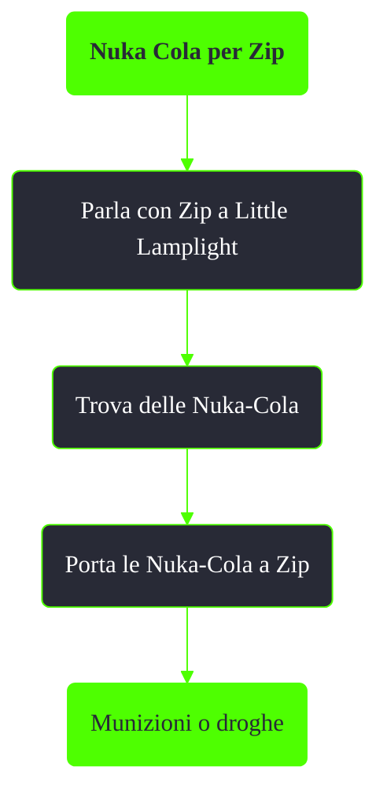

---
# Title, summary, and page position.
linktitle: Nuka Cola per Zip
summary: ""
weight: 10
icon: message-question
icon_pack: fas

# Page metadata.
title: Nuka Cola per Zip
date: 2022-11-15
type: book # Do not modify.
commentable: true
tags: "Missioni nascoste di Fallout 3"
hidden: true # Visibile nella sidebar
private: false # Nascosto dalle ricerche
---

*Nuka Cola per Zip* è una missione nascosta e ripetibile di Fallout 3. È data da Zip a Little Lamplight.

**Riassunto**:
1. Parla con Zip a Little Lamplight
2. Trova delle Nuka-Cola
3. Porta le Nuka-Cola a Zip
4. Ricompensa: **Munizioni** o **droghe**

<section class="chart-collapse">
<input type="checkbox" name="collapse2" id="handle2">
<h3 class="handle">
<label for="handle2">Clicca per mostrare il diagramma</label>
</h3>

</section>

**Note**:
- Gli oggetti ottenuti dipendono dal livello di Baratto del giocatore

