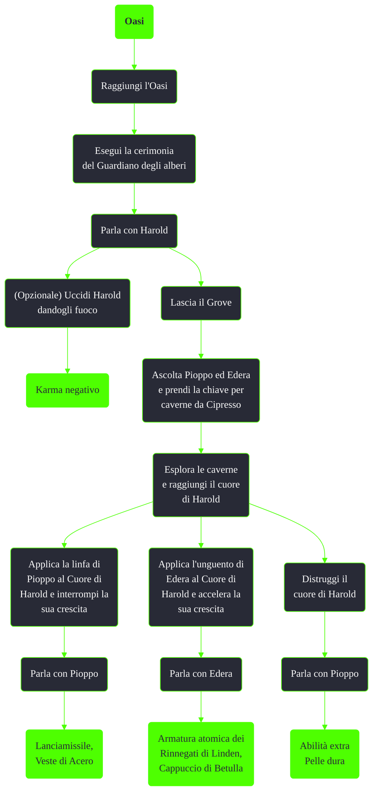

---
# Title, summary, and page position.
linktitle: Oasi
summary: ""
weight: 10
icon: messages # message-question per le missioni nascoste
icon_pack: fas

# Page metadata.
title: Oasi
date: 2022-11-15
type: book # Do not modify.
commentable: true
tags: "Missioni secondarie di Fallout 3"
hidden: true # Visibile nella sidebar
private: false # Nascosto dalle ricerche
---

*Oasi* è una missione secondaria di Fallout 3. È data da Harold all'Oasi.

<section class="chart-collapse">
<input type="checkbox" name="collapse2" id="handle2">
<h3 class="handle">
<label for="handle2">Clicca per mostrare il diagramma</label>
</h3>

</section>

| Tappe |       Stato        | Descrizione                                                                            |
| :---: | :----------------: | -------------------------------------------------------------------------------------- |
|   5   |                    | Esegui la cerimonia del Guardiano degli alberi.                                        |
|   8   |                    | (Facoltativo) Ottieni la chiave delle caverne dal Guardiano degli alberi Cipresso.     |
|  10   |                    | Accedi alle caverne sottostanti e distruggi il Cuore di Harold.                        |
|  20   |                    | (Facoltativo) Applica Linfa di Pioppo al Cuore di Harold e interrompi la sua crescita. |
|  30   |                    | (Facoltativo) Applica Unguento di Edera al Cuore di Harold e accelera la sua crescita. |
|  35   | :white_check_mark: | (Facoltativo) Uccidi Harold bruciandolo.                                               |
|  40   | :white_check_mark: | Parla con Padre Albero Pioppo.                                                         |
|  50   | :white_check_mark: | Parla con Madre foglia Edera.                                                          |

**Note**:
- Con le abilità Donatore di vita e Amico degli Animali saranno sbloccate altre opzioni di dialogo con Pioppo
- Uccidere Harold è considerato un atto così abominevole da essere citato nel finale del gioco, a meno che non si sia fatta esplodere la bomba di Megaton o ucciso gli abitanti di Rivet City, considerati atti ancora più crudeli
- È possibile uccidere Harold dopo aver completato la missione
- Sapling Yew darà il suo orsetto dopo una sfida Eloquenza o con l'abilità Bambino dentro, prima del completamento della missione. Possedere l'orsetto fa guadagnare un bonus permanente di 10 punti all'Eloquenza

