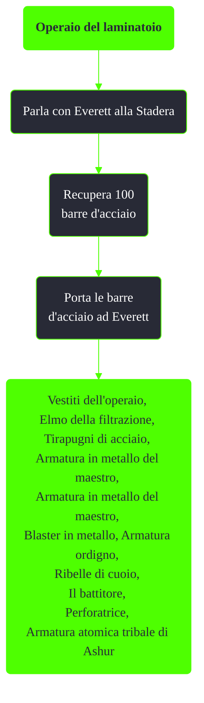

---
# Title, summary, and page position.
linktitle: Operaio del laminatoio
summary: ""
weight: 10
icon: message-question
icon_pack: fas

# Page metadata.
title: Operaio del laminatoio
date: 2022-11-15
type: book # Do not modify.
commentable: true
tags: "Missioni del Pitt"
hidden: true # Visibile nella sidebar
private: false # Nascosto dalle ricerche
---

*Operaio del laminatoio* è una missione nascosta del DLC *The Pitt* di Fallout 3. È data da Everett alla Stadera.

| N. lingotti | Premio                            | Peso |
|:-----------:| --------------------------------- |:----:|
|     10      | Vestiti dell'operaio              |  2   |
|     20      | Elmo della filtrazione            |  3   |
|     30      | Tirapugni di acciaio              |  1   |
|     40      | Armatura in metallo del maestro   |  15  |
|     50      | Blaster in metallo                |  8   |
|     60      | Armatura ordigno                  |  15  |
|     70      | Ribelle di cuoio                  |  15  |
|     80      | Il battitore                      |  20  |
|     90      | Perforatrice                      |  7   |
|     100     | Armatura atomica tribale di Ashur |  40  |

|          Immagine           | Quantità | Posizione                                                                                                                                                                                                                                                        |
|:---------------------------:|:--------:| ---------------------------------------------------------------------------------------------------------------------------------------------------------------------------------------------------------------------------------------------------------------- |
|    |    2     | Accanto al cadavere dello schiavo, subito dopo essere entrati nella stadera                                                                                                                                                                                      |
|    |    2     | Nel primo dei tre cassonetti a sinistra del rimorchio. Raggiungi a questo cassonetto saltando dal tetto del camion                                                                                                                                               |
|    |    2     | Nel secondo cassonetto a sinistra. Raggiungi a questo cassonetto saltando dal tetto dell'edificio vicino                                                                                                                                                         |
|    |    3     | Nel cassonetto più piccolo a ovest, con il cadavere di uno schiavo che pende all'esterno                                                                                                                                                                         |
| |    2     | Tra dei barili rovesciati. Vai su per le scale, oltre la recinzione rotta, prosegui a destra e poi a sinistra                                                                                                                                                    |
|    |    2     | In cima al vagone, sui binari che attraversano il centro della stadera                                                                                                                                                                                           |
|  |    3     | Ad est dei vagoni, in un cassonetto vicino all'ingresso dell'impianto di rifornimento                                                                                                                                                                            |
|    |    2     | Sullo scaffale fra due scatole di pronto soccorso. Dai cassonetti incontrati prima, prosegui a sinistra invece che a destra su per le scale, verso un piccolo edificio a destra                                                                                  |
|  |    2     | In un cassonetto, accessibile dal tetto dell'edificio precedente, attraverso il cancello                                                                                                                                                                         |
| |    2     | Oltre la recinzione a sud, verso il vicolo cieco a ovest, sotto una tubatura, vicino al cadavere di uno schiavo                                                                                                                                                  |
| |    2     | Dalle scale usate prima, andando a nord, oltre un'altra serie di scale che scendono verso un'area con una catasta di pneumatici, vicino a un mucchio di sangue e un troglodita                                                                                   |
|  |    3     | Verso est, poi a destra oltre un cancello e poi a sinistra, al termine di un canale, vicino al cadavere di uno schiavista                                                                                                                                        |
| |    3     | Fra dei barili irradiati, a sinistra dei lingotti precedenti                                                                                                                                                                                                     |
|  |    2     | Sul ponte improvvisato fra gli edifici. A sinistra del percorso precedente, oltre le scale, verso l'edificio. Svolta poi a destra, in direzione ovest, fino alla fine del tetto                                                                                  |
|  |    2     | Oltre il ponte improvvisato, sul tetto inferiore di un edificio, in direzione nord-ovest                                                                                                                                                                         |
|  |    2     | Su uno scaffale scendendo dal tetto dell'edificio                                                                                                                                                                                                                |
| |    2     | Prima dei cancelli aperti, sotto le scale sul lato di un edificio, dietro una pila di pneumatici                                                                                                                                                                 |
|  |    2     | Oltre i cancelli aperti e la rampa di scale a ovest, sul primo pianerottolo accanto al cadavere di Wild Bill                                                                                                                                                     |
| |    2     | Su per le scale, in una baracca dei selvaggi                                                                                                                                                                                                                     |
|  |    2     | Su una tubatura, accessibile dalla passerella attigua, a est della baracca                                                                                                                                                                                       |
|  |    4     | In un vagone, con delle munizioni e un kit di pronto soccorso. Dalla passerella precedente, scendi nell'edificio sottostante e dirigiti verso il bordo occidentale del tetto, poi a nord dietro l'angolo dell'edificio, a sinistra lungo il primo vicolo stretto |
|  |    2     | Vicino al cadavere di uno schiavo, seguendo la recinzione a nord, oltre diversi barili                                                                                                                                                                           |
| |    4     | Nell'angolo nord-ovest dietro al tetto a cupola accanto a due cassette di pronto soccorso. Dalle scale, dirigetevi a ovest e salite un'ulteriore serie di scale, svoltate a sinistra e poi a destra tra una fornace e un muro.                                   |
|    |    12    | Nella parte superiore della struttura al termine della passerella, sopra il livello con la torretta automatica                                                                                                                                                   |
|    |    7     | Oltre il nastro trasportatore verso est                                                                                                                                                                                                                          |
|  |    4     | Oltre la recinzione di collegamento sulla fornace, su una piattaforma sottostante, vicino a uno schiavo morto e un'ascia automatica, a sinistra dell'ultimo silo                                                                                                 |
|    |    2     | A nord-est dell'ingresso dell'impianto di rifornimento, oltre i pod dei Protettori e un tunnel crollato, vicino uno schiavo morto                                                                                                                                |
|   |    3     | Nella seconda stanza dell'impianto di rifornimento, per terra                                                                                                                                                                                                    |
|  |    8     | Al piano inferiore dell'impianto, alla fine dei binari, in un vagone rovesciato vicino a un selvaggio morto                                                                                                                                                      |
|   |  4 o 6   | In una stanza chiusa a chiave, sullo scaffale e sul pavimento                                                                                                                                                                                                    |
|   |    2     | In un vagone rovesciato nel un corridoio a nord-ovest                                                                                                                                                                                                            |
| |    1     | Nella camera da letto sul comodino                                                                                                                                                                                                                               | 
|  |    3     | Oltre la breccia dell'area abbandonata che collega la stadera e il mulino, accessibile dopo aver attivato l'interruttore all'impiaanto di rifornimento                                                                                                           |

Note:
- I primi lingotti sono nella stadera (79), 18 nell'impianto di rifornimento e 3 nell'area abbandonata, prima dell'uscita ma sbloccabile solo aver preso i primi dieci lingotti
- E' necessario avere Scasso 50 per accedere a una stanza contenente dei lingotti; rompere la serratura di questa stanza farà tecnicamente fallire questa missione

