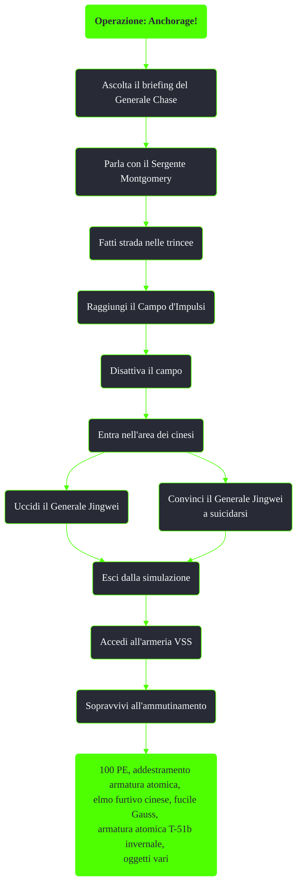

---
# Title, summary, and page position.
linktitle: "Operazione: Anchorage!"
summary: ""
weight: 10
icon: message-question
icon_pack: fas

# Page metadata.
title: "Operazione: Anchorage!"
date: 2022-11-15
type: book # Do not modify.
commentable: true
tags: "Missioni di Operation: Anchorage"
hidden: true # Visibile nella sidebar
private: false # Nascosto dalle ricerche
---

*Operazione: Anchorage!* è una missione del DLC *Operation: Anchorage* di Fallout 3. È data dal Generale Chase durante la simulazione della liberazione di Anchorage.

<section class="chart-collapse">
<input type="checkbox" name="collapse2" id="handle2">
<h3 class="handle">
<label for="handle2">Clicca per mostrare il diagramma</label>
</h3>

</section>

| Tappe |       Stato        | Descrizione |
| :---: | :----------------: | ----------- |
|  10     |                    |  Neutralizza il campo a impulsi.          |
|  11     |                    |   (Opzionale) Parla con il sergente Montgomery del comando della Squadra d'attacco.          |
| 20      |                    | Entra nell'area dei cinesi.            |
| 30      |                    |  Uccidi il generale Jingwei.           |
| 40      |                    |  Fai rapporto al generale Chase riportando le info sulla missione.           |
|  50     |                    |  Esci dal pod di simulazione.           |
|  60     |                    |  Accedi all'armeria VSS.           |
|  70     |:white_check_mark:                    | Entra nell'armeria VSS e prendi tutto quello che ti serve.            |

**Note**:
- Durante questa missione è possibile recuperare le ultime due valigette per *Operazioni sotto copertura*
  - Uccidendo il Difensore Sibley prima dell'ammutinamento i Rinnegati non diventeranno ostili e sarà possibile ottenere gli oggetti dell'armeria senza dover combatterli
- Finita la simulazione verrà aggiunta l'abilità per indossare le armature atomiche
- Prendere l'armatura atomica T-51b invernale farà terminare la missione *Devi mirare alla testa*, se già iniziata

