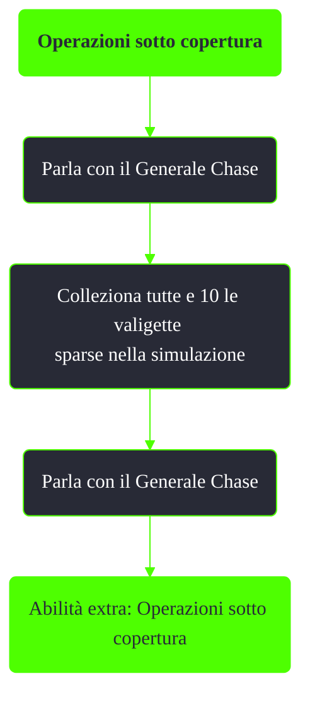

---
# Title, summary, and page position.
linktitle: Operazioni sotto copertura
summary: ""
weight: 10
icon: message-question
icon_pack: fas

# Page metadata.
title: Operazioni sotto copertura
date: 2022-11-15
type: book # Do not modify.
commentable: true
tags: "Missioni di Operation: Anchorage"
hidden: true # Visibile nella sidebar
private: false # Nascosto dalle ricerche
---

*Operazioni sotto copertura* è una missione nascosta del DLC *Operation: Anchorage* di Fallout 3. È data dal Generale Chase durante la simulazione della liberazione di Anchorage.

<section class="chart-collapse">
<input type="checkbox" name="collapse2" id="handle2">
<h3 class="handle">
<label for="handle2">Clicca per mostrare il diagramma</label>
</h3>

</section>

| Immagine                             | Luogo                                                                                                                                                                         |
| ------------------------------------ | ----------------------------------------------------------------------------------------------------------------------------------------------------------------------------- |
|  | Dopo aver attraversato il condotto sotto le scogliere, in una stanza chiusa (Scasso 15) sotto il terminale con l'olonastro "Bombardamento"                                    |
|             | Dopo il ponte sotto le scogliere, all'interno della stanza chiusa (Scasso 15) con l'olonastro "Addio"                                                                         |
|             | Dopo essere entrato nell'avamposto dell'artiglieria e passata la rampa di scale, in una stanza chiusa (Scasso 15) a sinistra del corridoio, assieme all'olonastro "Invasione" |
|             | Dopo aver superato i carrarmati Chimera, su una scrivania in una stanza con un terminale a muro (Scasso/Scienza 15)                                                          |
|             | Sulla strada verso il posto d'ascolto, nell'area delle miniere, su delle casse nell'edificio bombardato                                                                       |
|             | Posto d'ascolto, sotto le scale metalliche su uno scaffale                                                                                                                    |
|             | Campo avanzato delta cinese, verso il deposito Chimera, in una tenda dei cinesi                                                                                               |
|             | Deposito Chimera, nella capanna,  su un tavolo vicino a una radio amatoriale                                                                                                  |
|             | Nella trincea verso il campo a impulsi, nella baracca di legno, di fronte al soldato americano catturato                                                                      |
|             | Campo a impulsi, nell'edificio di controllo del campo, a sinistra del pulsante che lo disattiva                                                                               |

**Note**:
- L'abilità Operazioni sotto copertura conferisce un bonus permanente di 3 punti a Scienza, Armi leggere e Scasso
- Se non si raccolgono le prime 4 valigette prima di completare *Le armi di Anchorage*, non sarà possibile recuperarle una seconda volta

