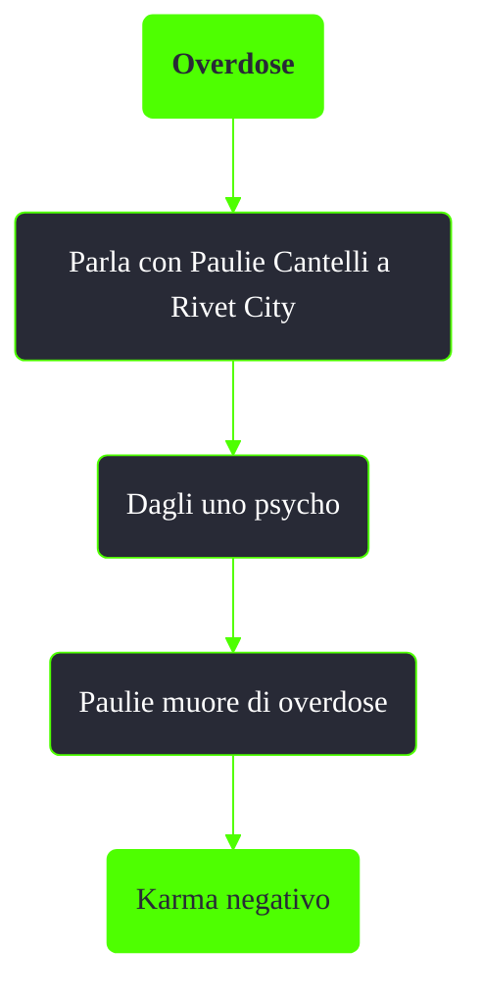

---
# Title, summary, and page position.
linktitle: Overdose
summary: ""
weight: 10
icon: message-question
icon_pack: fas

# Page metadata.
title: Overdose
date: 2022-11-15
type: book # Do not modify.
commentable: true
tags: "Missioni nascoste di Fallout 3"
hidden: true # Visibile nella sidebar
private: false # Nascosto dalle ricerche
---

*Overdose* è una missione nascosta di Fallout 3. È data da Paulie Cantelli a Rivet City.

<section class="chart-collapse">
<input type="checkbox" name="collapse2" id="handle2">
<h3 class="handle">
<label for="handle2">Clicca per mostrare il diagramma</label>
</h3>

</section>

**Note**:
- Uno psycho è sufficiente per farlo andare in overdose

