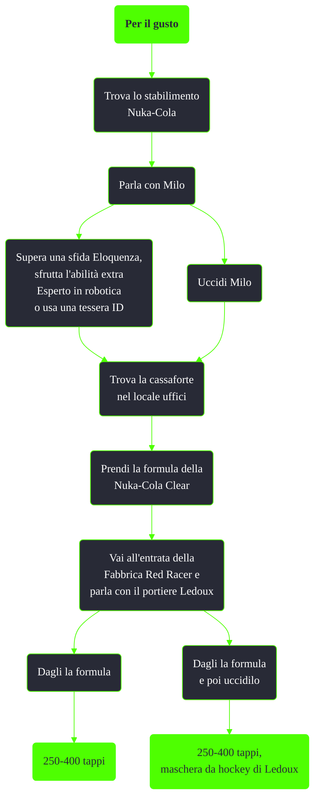

---
# Title, summary, and page position.
linktitle: Per il gusto
summary: ""
weight: 10
icon: message-question
icon_pack: fas

# Page metadata.
title: Per il gusto
date: 2022-11-15
type: book # Do not modify.
commentable: true
tags: "Missioni nascoste di Fallout 3"
hidden: true # Visibile nella sidebar
private: false # Nascosto dalle ricerche
---

*Per il gusto* è una missione nascosta di Fallout 3. È data interagendo con il corpo di Winger Mercier allo stabilimento Nuka-Cola.

**Riassunto**:
1. Trova lo stabilimento Nuka-Cola
2. Trova il corpo di Winger Mercier e prendi la nota "Trovare la Formula"
3. Parla con Milo
   - Supera una sfida Eloquenza
   - Sfrutta l'abilità extra Esperto in robotica
   - Usa una tessera ID
   - Uccidi Milo
4. Trova la cassaforte nel locale uffici
5. Prendi la formula della Nuka-Cola Clear
6. Vai all'entrata della Fabbrica Red Racer e parla con il portiere Ledoux
7. Dagli la formula
8. Ricompensa: **250-400 tappi**
9. (Opzionale) Uccidilo: **Maschera da hockey di Ledoux**

<section class="chart-collapse">
<input type="checkbox" name="collapse2" id="handle2">
<h3 class="handle">
<label for="handle2">Clicca per mostrare il diagramma</label>
</h3>

</section>

**Note**:
- Non è possibile ottenere la missione se si ha già completato *La sfida di Nuka Cola*
- Uccidendo Ledoux *prima* di consegnargli la formula, sul suo cadavere saranno presenti un numero minore di tappi di quanti si possano recuperare uccidendolo *dopo* avergli dato la formula

