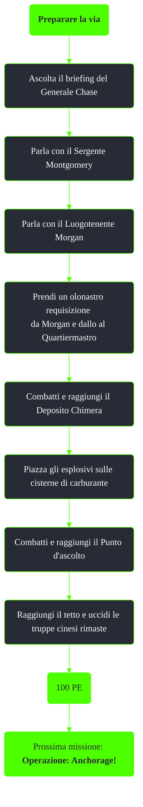

---
# Title, summary, and page position.
linktitle: Preparare la via
summary: ""
weight: 10
icon: message-question
icon_pack: fas

# Page metadata.
title: Preparare la via
date: 2022-11-15
type: book # Do not modify.
commentable: true
tags: "Missioni di Operation: Anchorage"
hidden: true # Visibile nella sidebar
private: false # Nascosto dalle ricerche
---

*Preparare la via* è una missione del DLC *Operation: Anchorage* di Fallout 3. È data dal Generale Chase durante la simulazione della liberazione di Anchorage.

<section class="chart-collapse">
<input type="checkbox" name="collapse2" id="handle2">
<h3 class="handle">
<label for="handle2">Clicca per mostrare il diagramma</label>
</h3>

</section>

| Tappe |       Stato        | Descrizione |
| :---: | :----------------: | ----------- |
|   10    |                    |  Ascolta il briefing del generale Chase.           |
|  15     |                    |  Parla con il luogotenente Morgan.           |
|  17     |                    | (Opzionale) Parla con il sergente Montgomery del comando della Squadra d'attacco.            |
|  20     |                    |  Distruggi due cisterne di carburante al deposito dei carri armati Monster.           |
|  30     | :white_check_mark: |  Prendi il posto di ascolto cinese.           |

**Note**:
- Durante questa missione è possibile recuperare altre quattro valigette per *Operazioni sotto copertura*, due lungo la strada al Deposito Chimera e al deposito stesso e due lungo la strada al Punto d'ascolto e al punto stesso

