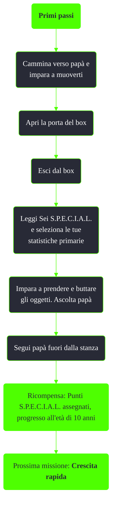

---
# Title, summary, and page position.
linktitle: Primi passi
summary: ""
weight: 10
icon: messages # message-question per le missioni nascoste
icon_pack: fas

# Page metadata.
title: Primi passi
date: 2022-11-15
type: book # Do not modify.
commentable: true
tags: "Missioni tutorial di Fallout 3"
hidden: true # Visibile nella sidebar
private: false # Nascosto dalle ricerche
---

*Primi passi* è la prima missione principale di Fallout 3. È data da James al Vault 101.

**Riassunto**:
1. Primi passi
2. Cammina verso papà e impara a muoverti
3. Apri la porta del box
4. Esci dal box
5. Leggi Sei S.P.E.C.I.A.L. e seleziona le tue statistiche primarie
6. Impara a prendere e buttare gli oggetti. Ascolta papà
7. Segui papà fuori dalla stanza
8. Ricompensa: **Punti S.P.E.C.I.A.L.** assegnati, progresso all'età di 10 anni
9. Prossima missione: *Crescita rapida*

<section class="chart-collapse">
<input type="checkbox" name="collapse2" id="handle2">
<h3 class="handle">
<label for="handle2">Clicca per mostrare il diagramma</label>
</h3>

</section>

| Tappe |       Stato        | Descrizione                       |
| :---: | :----------------: | --------------------------------- |
|  10   |                    | Vai da papà.                      |
|  20   |                    | Apri lo sportello della culla.    |
|  30   |                    | Esci dalla culla.                 |
|  40   |                    | Consulta il libro S.P.E.C.I.A.L.. |
|  80   | :white_check_mark: | Segui papà                        |

**Note**:
- Gli S.P.E.C.I.A.L. potranno essere riassegnati prima di abbandonare il Vault 101

