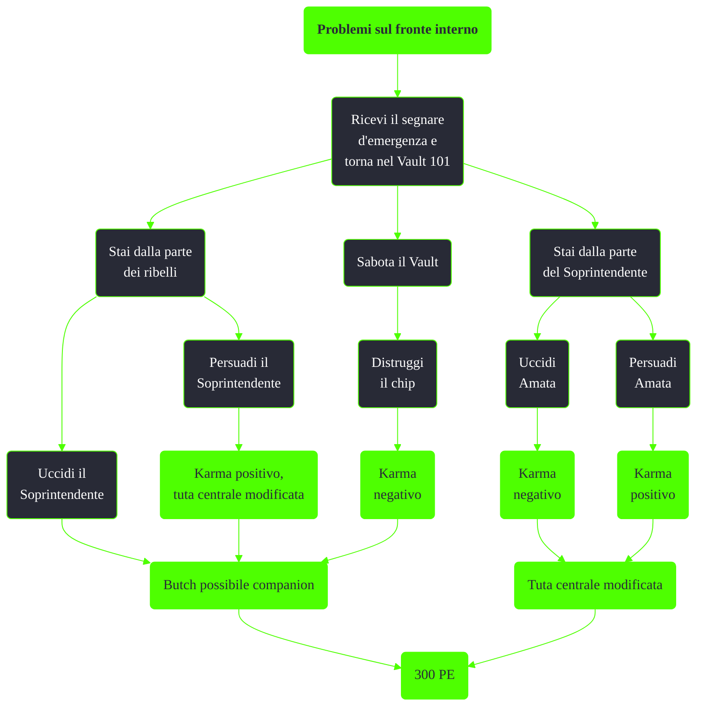

---
# Title, summary, and page position.
linktitle: Problemi sul fronte interno
summary: ""
weight: 10
icon: messages # message-question per le missioni nascoste
icon_pack: fas

# Page metadata.
title: Problemi sul fronte interno
date: 2022-11-15
type: book # Do not modify.
commentable: true
tags: "Missioni secondarie di Fallout 3"
hidden: true # Visibile nella sidebar
private: false # Nascosto dalle ricerche
---

*Problemi sul fronte interno* è una missione secondaria di Fallout 3. È data dal segnale d'emergenza del Vault 101.

**Riassunto**:
1. Scegli uno scieramento
   - Appoggia il Soprintendente
     - Uccidi Amata (**karma negativo**) o persuadila (**karma positivo**): **Tuta centrale modificata**
   - Appoggia i ribelli
     - Persuadi il Soprintendente (**karma positivo**, **Tuta centrale modificata**) oppure uccidilo: **Butch possibile companion**
   - Sabota il Vault
     - Distruggi il chip: **karma negativo**, **Butch possibile companion**
2. Ricompensa: **300 PE**

Note:
- Durante questa missione sarà ancora possibile ottenere la **Bambolina - Medicina** dall'ufficio di James, se non è stata già presa durante la missione *Scappa!*
- Nella stessa stanza, all'interno della cassaforte che è dietro il quadro, è possibile trovare gli **Schemi - Lanciatutto**
- Durante la missione sarà possibile fare il reverse pickpocketing a Butch e ottenere la sua arma unica, lo **Stuzzicadenti di Butch**

<section class="chart-collapse">
<input type="checkbox" name="collapse2" id="handle2">
<h3 class="handle">
<label for="handle2">Clicca per mostrare il diagramma</label>
</h3>

</section>

| Tappe |       Stato        | Descrizione                                   |
| :---: | :----------------: | --------------------------------------------- |
|  10   |                    | Torna al Vault 101.                           |
|  20   |                    | Scopri cosa è accaduto al Vault 101.          |
|  30   |                    | Metti fine ai problemi del Vault 101.         |
|  40   |                    | Ferma il Soprintendente.                      |
|  60   |                    | Ferma i ribelli.                              |
|  80   |                    | (Facoltativo) Sabota il Vault 101.            |
|  90   |                    | (Facoltativo) Lascia il Vault 101 per sempre. |
|  140  |                    | Parla con Amata.                              |
|  160  |                    | Parla con il Soprintendente.                  |
|  180  |                    | Evacua il Vault.                              |
|  190  | :white_check_mark: | Lascia il Vault 101 per sempre.               |
|  200  | :white_check_mark: | Tutti nel Vault 101 sono stati uccisi.        |

**Note**:
- Durante questa missione sarà ancora possibile ottenere la **Bambolina - Medicina** dall'ufficio di James, se non è stata già presa durante la missione *Scappa!*
- Nella stessa stanza, all'interno della cassaforte che è dietro il quadro, è possibile trovare gli **Schemi - Lanciatutto**
- Durante la missione sarà possibile fare il reverse pickpocketing a Butch e ottenere la sua arma unica, lo **Stuzzicadenti di Butch**

