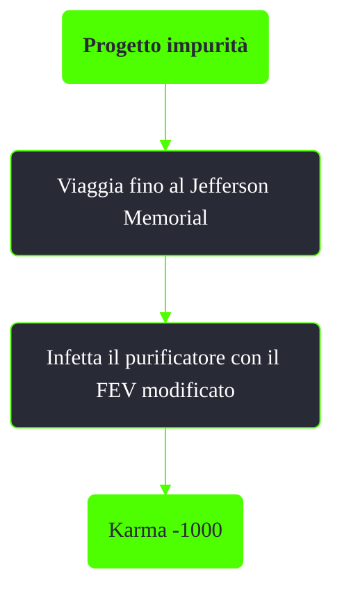

---
# Title, summary, and page position.
linktitle: Progetto impurità
summary: ""
weight: 40
icon: messages # message-question per le missioni nascoste
icon_pack: fas

# Page metadata.
title: Progetto impurità
date: 2022-11-15
type: book # Do not modify.
commentable: true
tags: "Missioni principali di Fallout 3"
hidden: true # Visibile nella sidebar
private: false # Nascosto dalle ricerche
---

*Progetto impurità* è una missione principale di Fallout 3. È data dal presidente Eden al Jefferson Memorial ed è correlata con la missione *[Riprenditelo!](../riprenditelo)*.

**Riassunto**:
1. Viaggia fino al Jefferson Memorial
2. Infetta il purificatore con il FEV modificato
3. Ricompensa: **karma negativo**

<section class="chart-collapse">
<input type="checkbox" name="collapse2" id="handle2">
<h3 class="handle">
<label for="handle2">Clicca per mostrare il diagramma</label>
</h3>

</section>

| Tappe | Stato              | Descrizione |
| :-----: | :------------------: | ----------- |
|   1    |                    |  Segui Liberty Prime mentre si fa strada verso il purificatore.           |
|   2    |                    | Raggiungi la sala di controllo del Progetto purezza.             |
|   3    |    :white_check_mark:                |    Infetta l'acqua del Progetto purezza... oppure no.         |

**Note**:
- È possibile finire il gioco con un karma positivo anche se si infetta il purificatore, basta che il giocatore lo avvii personalmente (-1000 + +2000 karma)
- Se il giocatore dà la fiala a Lyons l'Anziano non sarà possibile infettare il purificatore

