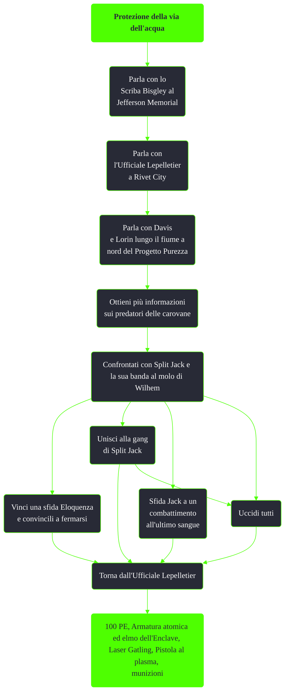

---
# Title, summary, and page position.
linktitle: Protezione della via dell'acqua
summary: ""
weight: 10
icon: message-question
icon_pack: fas

# Page metadata.
title: Protezione della via dell'acqua
date: 2022-11-15
type: book # Do not modify.
commentable: true
tags: "Missioni di Broken Steel"
hidden: true # Visibile nella sidebar
private: false # Nascosto dalle ricerche
---

*Protezione della via dell'acqua* è una missione secondaria del DLC *Broken Steel* di Fallout 3. È data dallo Scriba Bisgley al Jefferson Memorial.

<section class="chart-collapse">
<input type="checkbox" name="collapse2" id="handle2">
<h3 class="handle">
<label for="handle2">Clicca per mostrare il diagramma</label>
</h3>

</section>

| Tappe |       Stato        | Descrizione                                                                                                                      |
|:-----:|:------------------:| -------------------------------------------------------------------------------------------------------------------------------- |
|   1   |                    | Consultati con l'ufficiale Lepelletier a Rivet City.                                                                             |
|   2   |                    | Incontra gli ufficiali Davis e Lorin lungo il fiume a nord del Progetto purezza.                                                 |
|   3   |                    | Scopri chi c'è dietro agli attacchi alle carovane.                                                                               |
|  10   |                    | Affronta Split Jack e la sua banda.                                                                                              |
|  100  |                    | Comunica all'ufficiale Lepelletier che il lavoro è stato completato.                                                             |
|  101  |                    | Comunica all'ufficiale Lepelletier che il lavoro è stato completato, OPPURE ricattala chiedendole soldi per la tua "protezione". |
|  150  |                    | Chiedi a Bigsley una ricompensa per aver aiutato l'ufficiale Lepelletier a Rivet City.                                           |
|  160  | :white_check_mark: | Raccogli più tappi che puoi dal pontile di Wilhelm una volta a settimana.                                                        |

**Note**:
- Indossare già un'armatura di metallo renderà amichevole Split Jack già al primo confronto
- Nonna Sparkle ucciderà tutti i membri della gang una volta scelta e superata la sfida Eloquenza

