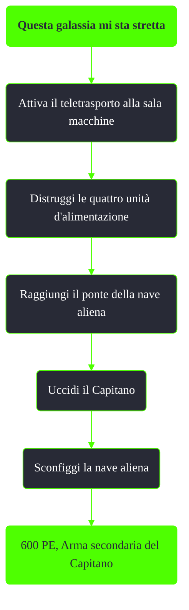

---
# Title, summary, and page position.
linktitle: "Questa galassia mi sta stretta..."
summary: ""
weight: 10
icon: message-question
icon_pack: fas

# Page metadata.
title: "Questa galassia mi sta stretta..."
date: 2022-11-15
type: book # Do not modify.
commentable: true
tags: "Missioni di Mothership Zeta"
hidden: true # Visibile nella sidebar
private: false # Nascosto dalle ricerche
---

*Questa galassia mi sta stretta* è una missione del DLC *Mothership Zeta* di Fallout 3. È data da Sally.

| Tappe |       Stato        | Descrizione                                              |
|:-----:|:------------------:| -------------------------------------------------------- |
|   5   |                    | Attiva il teletrasporto alla sala macchine.              |
|  10   |                    | Raggiungi il ponte della nave aliena.                    |
|  20   |                    | Disattiva il Raggio letale.                              |
|  25   |                    | Sconfiggi il Capitano alieno.                            |
|  30   |                    | Prendi il ponte.                                         |
|  40   |                    | Sconfiggi la nave aliena che attacca.                    |
|  50   |                    | Torna alla Zona contaminata della Capitale.              |
|  60   | :white_check_mark: | (Opzionale) Imposta l'autodistruzione della nave aliena. |

Note:
- Dalla consolle è possibile indirizzare le energie della nave agli scudi o al Raggio della Morte

