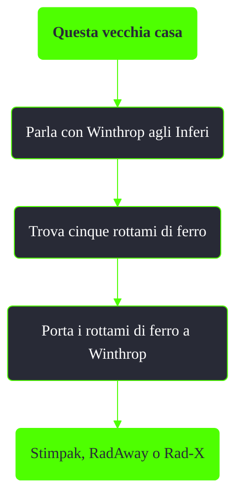

---
# Title, summary, and page position.
linktitle: Questa vecchia casa
summary: ""
weight: 10
icon: message-question
icon_pack: fas

# Page metadata.
title: Questa vecchia casa
date: 2022-11-15
type: book # Do not modify.
commentable: true
tags: "Missioni nascoste di Fallout 3"
hidden: true # Visibile nella sidebar
private: false # Nascosto dalle ricerche
---

*Questa vecchia casa* è una missione nascosta e ripetibile di Fallout 3. È data da Winthrop agli Inferi.

Note:
- Lo scambio offerto dal Protettore Casdin in *Baratto con i Rinnegati* è più vantaggioso
- Non ci sarà un guadagno di PE e tappi come invece avviene in *Rottami di ferro di Walter*