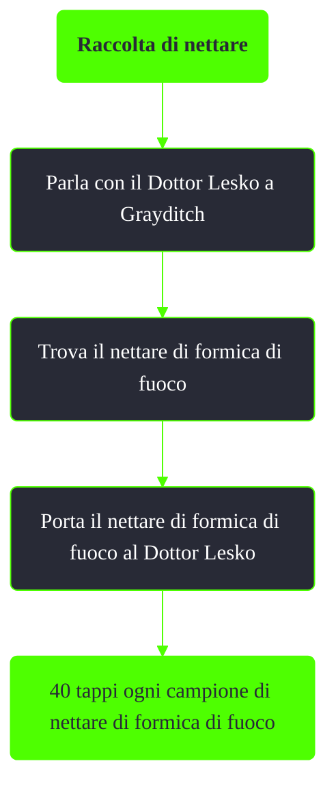

---
# Title, summary, and page position.
linktitle: Raccolta di nettare
summary: ""
weight: 10
icon: message-question
icon_pack: fas

# Page metadata.
title: Raccolta di nettare
date: 2022-11-15
type: book # Do not modify.
commentable: true
tags: "Missioni nascoste di Fallout 3"
hidden: true # Visibile nella sidebar
private: false # Nascosto dalle ricerche
---

*Raccolta di nettare* è una missione nascosta e ripetibile di Fallout 3. È data dal Dottor Lesko a Grayditch.

Note:
- Questa missione è ottenibile solo se si ha già nell'inventario del nettare di formica di fuoco
- Dopo aver completato *Mio Dio!* non compariranno più formiche di fuoco dalle quali depredare il nettare
    - Le formiche di fuoco operaie hanno circa il 40% di possibilità di droppare del nettare, mentre le guerriere circa il 70%
    - Maggiore è la Fortuna del giocatore e maggiori sono le possibilità di poter trovare del nettare di formica di fuoco