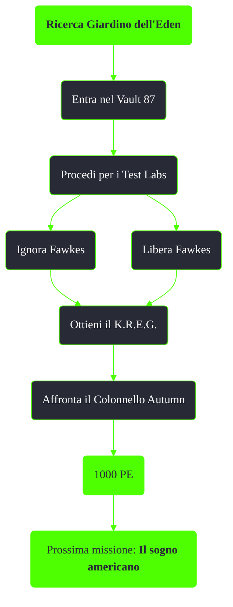

---
# Title, summary, and page position.
linktitle: Ricerca Giardino dell'Eden
summary: ""
weight: 40
icon: messages # message-question per le missioni nascoste
icon_pack: fas

# Page metadata.
title: Ricerca Giardino dell'Eden
date: 2022-11-15
type: book # Do not modify.
commentable: true
tags: "Missioni principali di Fallout 3"
hidden: true # Visibile nella sidebar
private: false # Nascosto dalle ricerche
---

*Ricerca Giardino dell'Eden* è la decima missione principale el gioco. È data dallo Scriba Rothchild alla Cittadella.

<section class="chart-collapse">
<input type="checkbox" name="collapse2" id="handle2">
<h3 class="handle">
<label for="handle2">Clicca per mostrare il diagramma</label>
</h3>

</section>

| Tappe |       Stato        | Descrizione                                             |
| :---: | :----------------: | ------------------------------------------------------- |
|  10   |                    | Trova l'ingresso sotterraneo del Vault 87.              |
|  15   |                    | Recupera il K.R.E.G.                                    |
|  20   |                    | (Facoltativo) Salva Fawkes dalle celle di osservazione. |
|  30   | :white_check_mark: | Fuggi dal Vault 87.                                     |

**Note**:
- È richiesta Scienza 50 e 75 per sbloccare tutti i terminali
- Nella camera a destra a quella in cui si ottiene il K.R.E.G. c'è una tuta antiradiazioni avanzata

