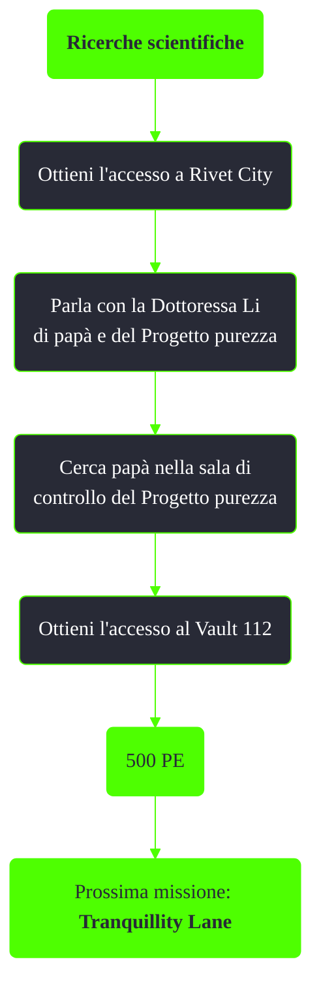

---
# Title, summary, and page position.
linktitle: Ricerche scientifiche
summary: ""
weight: 10
icon: messages # message-question per le missioni nascoste
icon_pack: fas

# Page metadata.
title: Ricerche scientifiche
date: 2022-11-15
type: book # Do not modify.
commentable: true
tags: "Missioni principali di Fallout 3"
hidden: true # Visibile nella sidebar
private: false # Nascosto dalle ricerche
---

*Ricerche scientifiche* è la sesta missione principale di Fallout 3. E' data da Tre cani all'edificio di GNR o dalla Dottoressa Li a Rivet City.

| Tappe |       Stato        | Descrizione                                                         |
| :---: | :----------------: | ------------------------------------------------------------------- |
|  10     |                    | Ottieni l'accesso a Rivet City.                                     |
|  20     |                    | Parla con la Dottoressa Li di papà e del Progetto purezza.          |
|  30     |                    | Cerca papà nella sala di controllo del Progetto purezza.            |
| 40      |                    | Cerca gli olonastri di papà per trovare indizi sulla sua posizione. |
|  50     |                    | Ascolta la voce n. 10 del diario personale di papà.                 |
|  60     |                    | Ottieni l'accesso al Vault 112.                                     |
| 65      |                    | Indossa una tuta del Vault 112.                                     |
| 70      | :white_check_mark: | Siediti nella "Poltrona rilassante" libera.                         |

Note:
- E' possibile saltare buona parte di questa missione parlando direttamente con la Dottoressa Li o dirigendoci al Vault 112 o al Jefferson Memorial