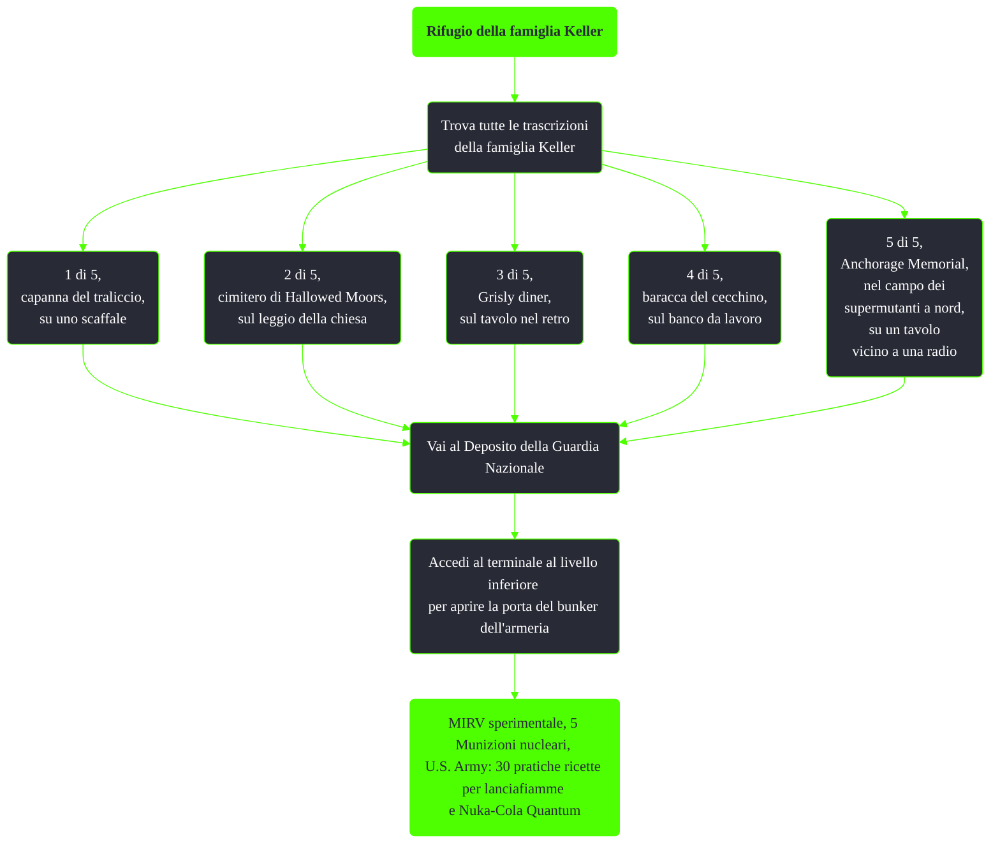

---
# Title, summary, and page position.
linktitle: Rifugio della famiglia Keller
summary: ""
weight: 10
icon: message-question
icon_pack: fas

# Page metadata.
title: Rifugio della famiglia Keller
date: 2022-11-15
type: book # Do not modify.
commentable: true
tags: "Missioni nascoste di Fallout 3"
hidden: true # Visibile nella sidebar
private: false # Nascosto dalle ricerche
---

*Rifugio della famiglia Keller* è una missione nascosta di Fallout 3. È data da TODO a TODO.

| Immagine                                                          | Oggetto e posizione                                                                                         |
| ----------------------------------------------------------------- | ----------------------------------------------------------------------------------------------------------- |
|  | **Trascrizione famiglia Keller 1 di 5**, su uno scaffale                                                    |
|                | **Trascrizione famiglia Keller 2 di 5**, sul leggio nella chiesa                                            |
|    | **Trascrizione famiglia Keller 3 di 5**, su una scrivania sul retro                                         |
|                    | **Trascrizione famiglia Keller 4 di 5**, sopra e nei pressi del banco da lavoro                             |
|             | **Trascrizione famiglia Keller 5 di 5**, nel campo dei super mutanti, su un tavolo all'interno di una tenda |

