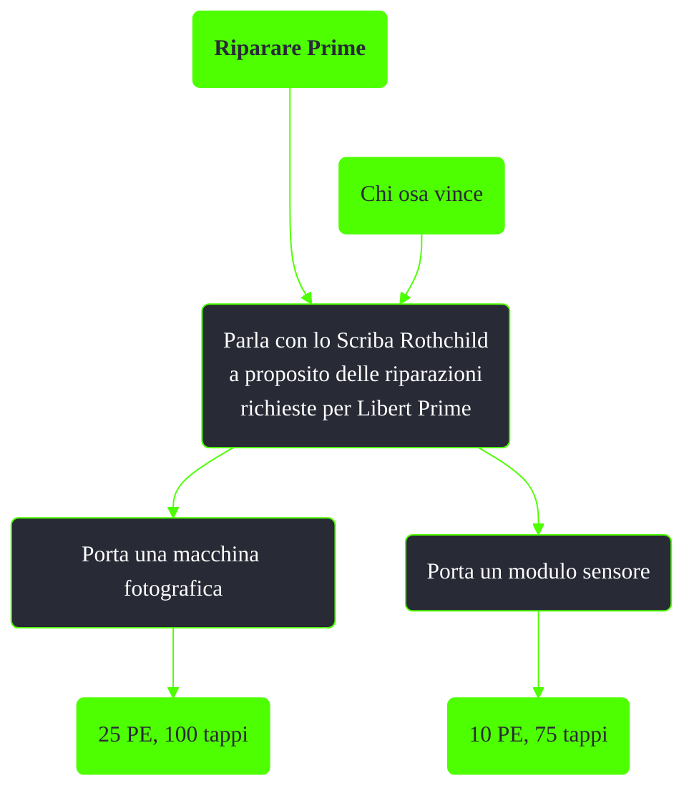

---
# Title, summary, and page position.
linktitle: Riparare Prime
summary: ""
weight: 10
icon: message-question
icon_pack: fas

# Page metadata.
title: Riparare Prime
date: 2022-11-15
type: book # Do not modify.
commentable: true
tags: "Missioni di Broken Steel"
hidden: true # Visibile nella sidebar
private: false # Nascosto dalle ricerche
---

*Riparare Prime* è una missione del DLC *Broken Steel* di Fallout 3. È data dallo Scriba Rothchild alla Cittadella.

Note:
- Qualsiasi sia il numero di macchine fotografiche o moduli sensore consegnati, Liberty Prime non sarà mai riparato
- Se la Cittadella è stata distrutta durante *Chi osa vince*, non sarà possibile ottenere questa missione
