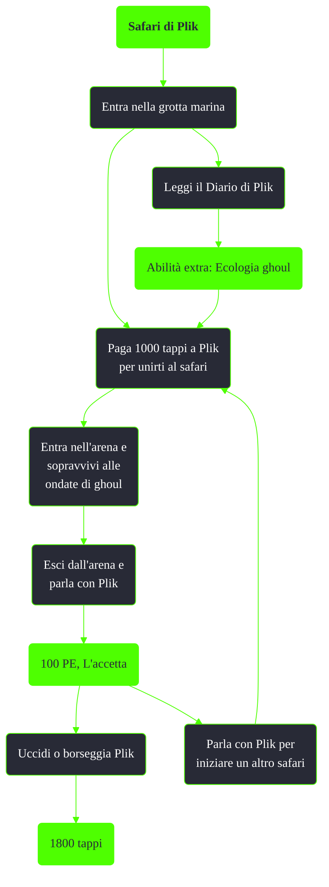

---
# Title, summary, and page position.
linktitle: TODO
summary: ""
weight: 10
icon: message-question
icon_pack: fas

# Page metadata.
title: TODO
date: 2022-11-15
type: book # Do not modify.
commentable: true
tags: "Missioni di Point Lookout"
hidden: true # Visibile nella sidebar
private: false # Nascosto dalle ricerche
---

*Safari di Plik* è una missione secondaria del DLC *Point Lookout* di Fallout 3. È data da Plik alla grotta marina.

| Tappe |       Stato        | Descrizione                                                      |
|:-----:|:------------------:| ---------------------------------------------------------------- |
|  10   |                    | Paga a Plik 1.000  tappi per partecipare a questo safari.        |
|  50   |                    | Entra nell'arena e dai il segnale a Plik per iniziare il safari. |
|  51   |                    | Sopravvivi al safari di Plik.                                    |
|  70   | :white_check_mark: | Fai sapere a Plik che sei sopravvissuto al suo safari.           |

Note:
- Il diario di Plik si trova su un tavolo, in una stanza a sinistra di Plik, nella grotta marina
- Uccidere Plik non farà guadagnare karma negativo
- La maschera ghoul è di grande aiuto in questa missione
