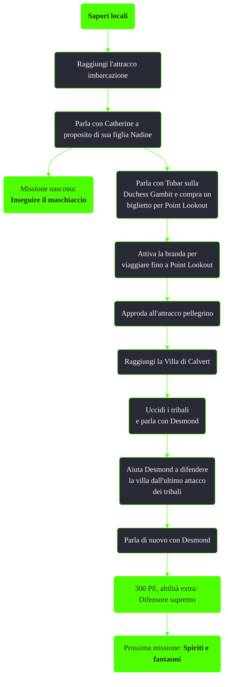

---
# Title, summary, and page position.
linktitle: Sapori locali
summary: ""
weight: 10
icon: message-question
icon_pack: fas

# Page metadata.
title: Sapori locali
date: 2022-11-15
type: book # Do not modify.
commentable: true
tags: "Missioni di Point Lookout"
hidden: true # Visibile nella sidebar
private: false # Nascosto dalle ricerche
---

*Sapori locali* è una missione del DLC *Point Lookout* di Fallout 3. È data dal messaggio radio sul Pip-Boy, una volta usciti dal Vault 101.

<section class="chart-collapse">
<input type="checkbox" name="collapse2" id="handle2">
<h3 class="handle">
<label for="handle2">Clicca per mostrare il diagramma</label>
</h3>

</section>

| Tappe |       Stato        | Descrizione                                                  |
|:-----:|:------------------:| ------------------------------------------------------------ |
|  10   |                    | Perlustra la barca da fiume.                                 |
|  30   |                    | Assicurati il passaggio verso Point Lookout.                  |
|  50   |                    | Riposati durante il viaggio verso Point Lookout.             |
|  100  |                    | Lascia la Duchessa Gambit.                                   |
|  120  |                    | Perlustra la villa.                                          |
|  130  |                    | Aiuta il proprietario della villa a respingere gli invasori. |
|  160  |                    | Blocca la breccia al piano di sopra nell'ala ovest.          |
|  165  |                    | Blocca la breccia nell'ala est.                              | 
|  170  |                    | Neutralizza l'ultima schiera di invasori.                    |
|  190  | :white_check_mark: | Parla con il proprietario della villa.                       |

**Note**:
- Come per ogni altro DLC, non sarà possibile portare i propri Seguaci a Point Lookout

