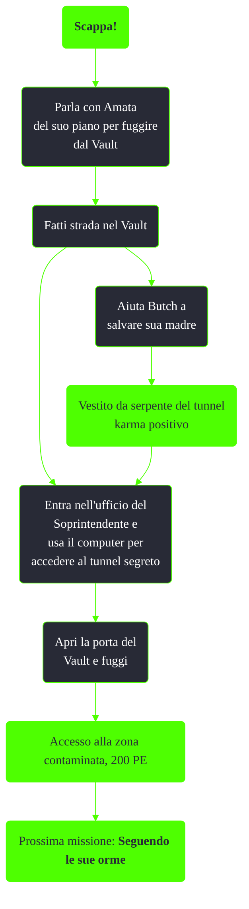

---
# Title, summary, and page position.
linktitle: Scappa!
summary: ""
weight: 10
icon: messages # message-question per le missioni nascoste
icon_pack: fas

# Page metadata.
title: Scappa!
date: 2022-11-15
type: book # Do not modify.
commentable: true
tags: "Missioni tutorial di Fallout 3"
hidden: true # Visibile nella sidebar
private: false # Nascosto dalle ricerche
---

*Scappa!* è la quarta missione principale di Fallout 3. È data da Amata al Vault 101.

<section class="chart-collapse">
<input type="checkbox" name="collapse2" id="handle2">
<h3 class="handle">
<label for="handle2">Clicca per mostrare il diagramma</label>
</h3>

</section>

| Tappe |       Stato        | Descrizione                                                        |
| :---: | :----------------: | ------------------------------------------------------------------ |
|   5   |                    | Parla con Amata del suo piano per fuggire dal Vault.               |
|  10   |                    | Entra nell'ufficio del Soprintendente.                             |
|  40   |                    | Usa il computer del Soprintendente per accedere al tunnel segreto. |
|  50   |                    | Entra nella sala di controllo del reattore.                        |
|  60   |                    | Attiva nuovamente l'alimentazione.                                 |
|  70   |                    | Apri la porta del Vault.                                           |
|  80   | :white_check_mark: | Fuggi dal Vault.                                                   |

**Note**:
- A prescindere dall'esperienza guadagnata durante questa missione, non si salirà di livello fintanto che non si lascia il Vault
- È possibile cambiare l'aspetto fisico e riassegnare gli S.P.E.C.I.A.L. e le specialità poco prima di uscire dal Vault
- Tutti possono essere uccisi, tranne Amata, Andy e Stanley
  - Se il Soprintendente muore, Amata sarà arrabbiata con il protagonista; Butch avrà la stessa reazione se Ellen muore

