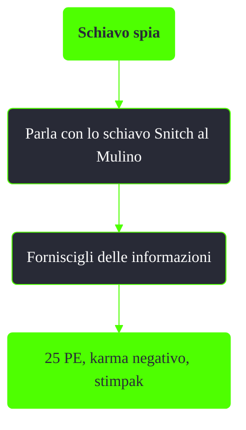

---
# Title, summary, and page position.
linktitle: Schiavo spia
summary: ""
weight: 10
icon: message-question
icon_pack: fas

# Page metadata.
title: Schiavo spia
date: 2022-11-15
type: book # Do not modify.
commentable: true
tags: "Missioni del Pitt"
hidden: true # Visibile nella sidebar
private: false # Nascosto dalle ricerche
---

*Schiavo spia* è una missione nascosta del DLC *The Pitt* di Fallout 3. È data da Snitch al Mulino.

**Riassunto**:
1. Parla con lo schiavo Snitch al Mulino
2. Forniscigli delle informazioni
3. Ricompensa: **25 PE**, **karma negativo**, **stimpak**

<section class="chart-collapse">
<input type="checkbox" name="collapse2" id="handle2">
<h3 class="handle">
<label for="handle2">Clicca per mostrare il diagramma</label>
</h3>

</section>

**Note**:
- Questa missione ha un effetto piuttosto limitato sulla trama principale del DLC
- Dire a Snitch che Marco sta fabbricando delle armi lo farà uccidere all'istante

