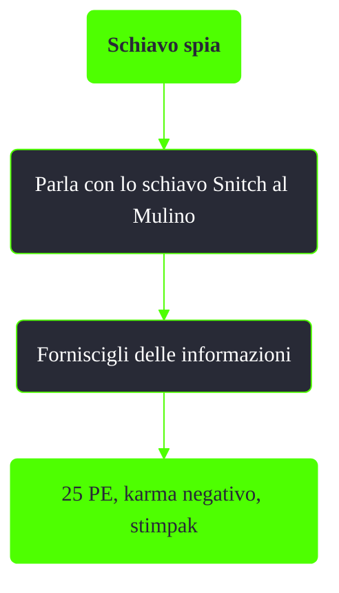

---
# Title, summary, and page position.
linktitle: Schiavo spia
summary: ""
weight: 10
icon: message-question
icon_pack: fas

# Page metadata.
title: Schiavo spia
date: 2022-11-15
type: book # Do not modify.
commentable: true
tags: "Missioni del Pitt"
hidden: true # Visibile nella sidebar
private: false # Nascosto dalle ricerche
---

*Schiavo spia* è una missione nascosta del DLC *The Pitt* di Fallout 3. È data da TODO a TODO.

Note:
- Questa missione ha un effetto piuttosto limitato sulla trama principale del DLC
- Dire a Snitch che Marco sta fabbricando delle armi lo farà uccidere all'istante

