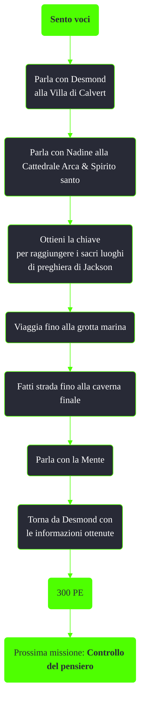

---
# Title, summary, and page position.
linktitle: Sento voci
summary: ""
weight: 10
icon: message-question
icon_pack: fas

# Page metadata.
title: Sento voci
date: 2022-11-15
type: book # Do not modify.
commentable: true
tags: "Missioni di Point Lookout"
hidden: true # Visibile nella sidebar
private: false # Nascosto dalle ricerche
---

*Sento voci* è una missione del DLC *Point Lookout* di Fallout 3. È data da Desmond alla Villa di Calvert.

<section class="chart-collapse">
<input type="checkbox" name="collapse2" id="handle2">
<h3 class="handle">
<label for="handle2">Clicca per mostrare il diagramma</label>
</h3>

</section>

| Tappe |       Stato        | Descrizione                                           |
|:-----:|:------------------:| ----------------------------------------------------- |
|  10   |                    | Trova il capo dei tribali.                            |
|  30   |                    | Torna da Desmond con le informazioni.                 |
|  50   |                    | Recupera ulteriori informazioni sul capo dei tribali. |
|  150  | :white_check_mark: | Cerca ulteriori informazioni sulla Mente.             |

**Note**:
- E' possibile saltare la prima parte della missione e procedere direttamente per la grotta marina
- Appena usciti dalla grotta comparirà un gruppo di ghoul feroci 

