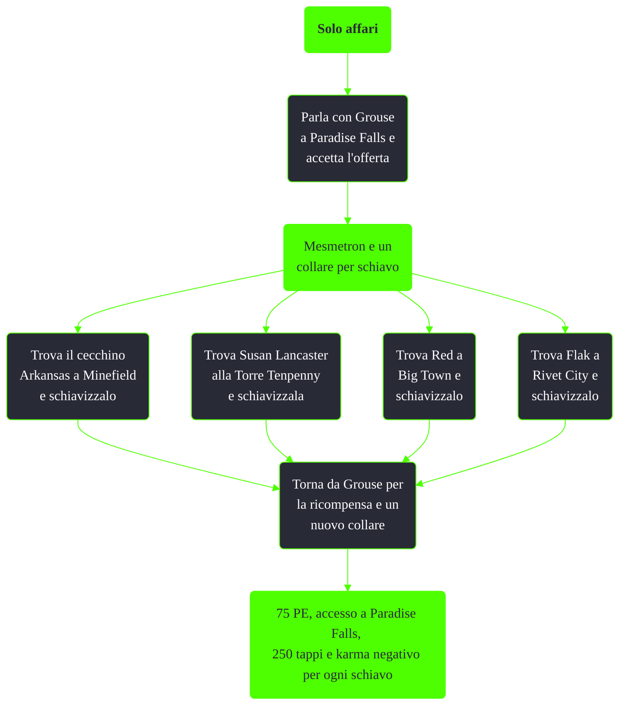

---
# Title, summary, and page position.
linktitle: Solo affari
summary: ""
weight: 10
icon: messages # message-question per le missioni nascoste
icon_pack: fas

# Page metadata.
title: Solo affari
date: 2022-11-15
type: book # Do not modify.
commentable: true
tags: "Missioni secondarie di Fallout 3"
hidden: true # Visibile nella sidebar
private: false # Nascosto dalle ricerche
---

*Solo affari* è una missione secondaria di Fallout 3. E' data da Grouse a Paradise Falls.

| Tappe | Stato              | Descrizione |
| :-----: | :------------------: | ----------- |
|   1    |                    |  Rendi schiavo il cecchino Arkansas del campo minato.           |
|    2   |                    |   Rendi schiava Susan Lancaster della Torre di Tenpenny.          |
|  3     |                    |  Rendi schiavo Red di Big Town.           |
|   4    |                    |   Rendi schiavo Flak di Rivet City          |
|   5    |                    |   Torna da Grouse.          |

Note:
- E' possibile utilizzare il Mesmetron e il collare da schiavo per schiavizzare altre persone (vedi *Solo profitti*) al di fuori della lista data da Grouse e ottenere comunque 250 tappi. Tuttavia per completare la missione è necessario rendere schiavi i quattro elencati
- Ogni volta che si schiavizza qualcuno si perdono 100 punti karma, indipendentemente dal fatto che quella persona sia un buona o cattiva
- E' consigliato usare il viaggio rapido verso Paradise Falls subito dopo aver schiavizzato una persona: questo per evitare che essa finisca per rimanere uccisa nella sua fuga verso la capitale schiavista e per ottenere subito i tappi e un nuovo collare
- Dopo aver terminato la missione, Grouse ci consegnerà un altro collare per schiavi per poter consinuare la missione nascosta e ripetibile *Solo profitti*
- E' possibile schiavizzare Red prima di completare *Grossi problemi a Big Town*, liberandola e usando il viaggio rapido per evitare che Grouse la uccida
- E' possibile liberare i quattro schiavi designati, dopo aver terminato la missione. Essi torneranno al loro punto  d'origine ma non sarà più possibile barattare merce con loro
- Uccidere Grouse farà fallire immediatamente la missione
- Entrare a Paradise Falls senza parlare prima con Grouse renderà tutti gli schiavisti ostili e si guadagnerà karma positivo