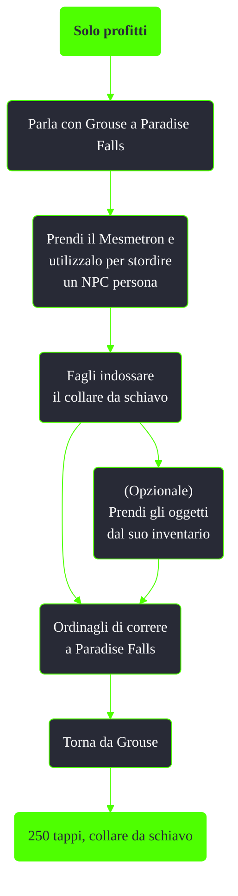

---
# Title, summary, and page position.
linktitle: Solo profitti
summary: ""
weight: 10
icon: message-question
icon_pack: fas

# Page metadata.
title: Solo profitti
date: 2022-11-15
type: book # Do not modify.
commentable: true
tags: "Missioni nascoste di Fallout 3"
hidden: true # Visibile nella sidebar
private: false # Nascosto dalle ricerche
---

*Solo profitti* è una missione nascosta e ripetibile di Fallout 3. È data da Grouse a Paradise Falls.

**Riassunto**:
1. Parla con Grouse a Paradise Falls
2. Prendi il Mesmetron e utilizzalo per stordire un NPC persona
3. Fagli indossare il collare da schiavo: **karma negativo**
4. (Opzionale) Prendi gli oggetti dal suo inventario
5. Ordinagli di correre a Paradise Falls
6. Torna da Grouse
7. Ricompensa: **250 tappi**, **collare da schiavo**

<section class="chart-collapse">
<input type="checkbox" name="collapse2" id="handle2">
<h3 class="handle">
<label for="handle2">Clicca per mostrare il diagramma</label>
</h3>

</section>

**Note**:
- Ad eccezione degli NPC da schiavizzare in *Solo affari*, tutti scompariranno una volta raggiunta Paradise Falls

