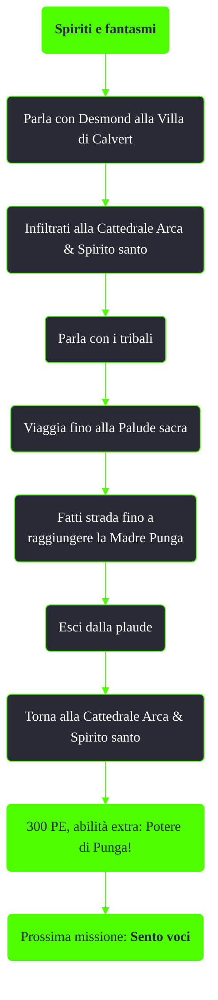

---
# Title, summary, and page position.
linktitle: Spiriti e fantasmi
summary: ""
weight: 10
icon: message-question
icon_pack: fas

# Page metadata.
title: Spiriti e fantasmi
date: 2022-11-15
type: book # Do not modify.
commentable: true
tags: "Missioni di Point Lookout"
hidden: true # Visibile nella sidebar
private: false # Nascosto dalle ricerche
---

*Spiriti e fantasmi* è una missione del DLC *Point Lookout* di Fallout 3. È data da Desmond alla Villa di Calvert.

<section class="chart-collapse">
<input type="checkbox" name="collapse2" id="handle2">
<h3 class="handle">
<label for="handle2">Clicca per mostrare il diagramma</label>
</h3>

</section>

| Tappe |       Stato        | Descrizione                                         |
|:-----:|:------------------:| --------------------------------------------------- |
|   5   |                    | Parla con Desmond della sua offerta.                |
|  10   |                    | Recupera informazioni sui tribali della Cattedrale. |
|  100  |                    | Raccogli i semi della pianta gigante di Punga.      |
|  150  | :white_check_mark: | Torna alla Cattedrale.                              |

