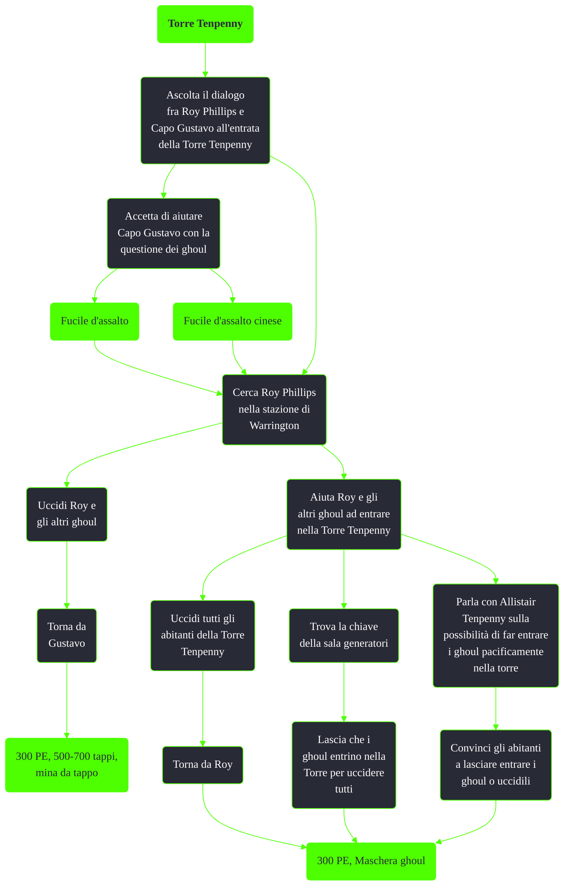

---
# Title, summary, and page position.
linktitle: Torre Tenpenny
summary: ""
weight: 10
icon: messages # message-question per le missioni nascoste
icon_pack: fas

# Page metadata.
title: Torre Tenpenny
date: 2022-11-15
type: book # Do not modify.
commentable: true
tags: "Missioni secondarie di Fallout 3"
hidden: true # Visibile nella sidebar
private: false # Nascosto dalle ricerche
---

*Torre Tenpenny* è una missione secondaria di Fallout 3. È data da Capo Gustavo alla Torre Tenpenny o Roy Phillips alla stazione di Warrington.

<section class="chart-collapse">
<input type="checkbox" name="collapse2" id="handle2">
<h3 class="handle">
<label for="handle2">Clicca per mostrare il diagramma</label>
</h3>

</section>

| Tappe |       Stato        | Descrizione                                                                                    |
| :---: | :----------------: | ---------------------------------------------------------------------------------------------- |
|  10   |                    | Uccidi Roy Phillips e i suoi seguaci.                                                          |
|  11   |                    | Uccidi Roy Phillips e i suoi seguaci oppure aiuta i ghoul ad entrare nella Torre di Tenpenny.  |
|  20   |                    | Fai un rapporto al Capo Gustavo.                                                               |
|  100  |                    | Aiuta i ghoul ad entrare nella Torre di Tenpenny.                                              |
|  101  |                    | Aiuta i ghoul ad entrare nella Torre di Tenpenny oppure uccidi Roy Phillips e i suoi seguaci . |
|  120  | :white_check_mark: | Avvisa Roy Phillips che i ghoul possono entrare.                                               |

**Note**:
- Se si hanno altre missioni in corso come *Un servitore maltrattato* e *Solo affari* è consigliabile non dire a Capo Gustavo agli altri residenti di voler risolvere il problema dei ghoul, così da non far partire immediatamente la missione
  - Bisogna schiavizzare Susan Lancaster prima di far partire la missione e di parlare con Allistair Tenpenny
- Non nominare il Sig. Crawley ad Allistair Tenpenny altrimenti questo diventerà ostile e non sarà possibile risolvere pacificamente la missione
- Rubare dalle casseforti dei negozi all'interno della torre renderà impossibile completare la missione
- Può succedere che Roy Philips venga ucciso  durante il suo rientro alla stazione di Warrington da alcuni predatori
- Se si ha già attiva la missione *Devi mirare alla testa* è necessario uccidere con un colpo Tenpenny non appena ci ha dato la ricompensa per aver ottenuto l'accordo pacifico. In caso contrario Roy e i ghoul lo uccideranno e non sarà possibile ottenere il bonus tappi
- È possibile comprare gli **Schemi - Pistola a dardi** da Lydia Montenegro, o rubandoli dalla sua cassaforte una volta uccisa
- Herbert Dashwood ci darà gli **Schemi - Mina da tappo** una volta che lo informeremo della morte di Argyle
  - Il cadavere di Argyle si trova a Rockopolis
- È possibile uccidere i residenti della torre anche dopo aver siglato l'accordo con i ghoul, per ottenere importante loot e tappi
- È possibile risolvere la missione pacificamente, senza interferire con *Devi mirare alla testa* e *Solo affari*, ottenere 500 tappi e la maschera da ghoul nel seguente modo: 
    1. Entra nella Torre Tenpenny, senza dire a Capo Gustavo di voler risolvere il problema dei ghoul
    2. Parla con Herbert Dashwood a proposito di Argyle, per ottenere gli **Schemi - Mina da tappo**
    3. Schiavizza Susan Lancaster per la missione *Solo affari*
    4. Parla con Capo Gustavo e far partire la missione
    5 . Vai da Roy Phillips alla stazione di Warrington e proporre un accordo pacifico
    5. Vai da Allistair Tenpenny e convincerlo di far entrare i ghoul. Evita di parlare del Sig. Crawley
    6. Convinci Lydia Montenegro a far entrare i ghoul e poi ucciderla
       1. È possibile spingerla nei bagni e ucciderla silenziosamente senza allerta gli altri residenti)
       2. Nella sua cassaforte sarà possibile ottenere gli **Schemi - Pistola a dardi** e 300 tappi
    7. Convinci Anthony King a far entrare i ghoul e poi ucciderlo. Nella sua cassaforte saranno presenti 300 tappi
    8. Convinci Millicent Wellington ed Edgar Wellington III
    9.  Informa Tenpenny che i residenti sono d'accordo nel far entrare i ghoul per ricevere 500 tappi e, immediatamente, uccidilo con un colpo alla testa per la missione *Devi mirare alla testa*
    10. Torna da Roy Phillips per ricevere la maschera ghoul

