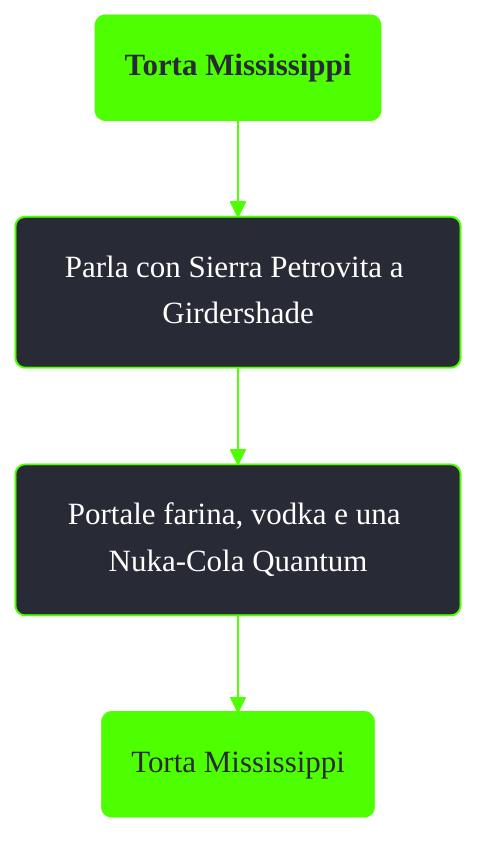

---
# Title, summary, and page position.
linktitle: Torta Mississippi
summary: ""
weight: 10
icon: message-question
icon_pack: fas

# Page metadata.
title: Torta Mississippi
date: 2022-11-15
type: book # Do not modify.
commentable: true
tags: "Missioni nascoste di Fallout 3"
hidden: true # Visibile nella sidebar
private: false # Nascosto dalle ricerche
---

*Torta Mississippi* è una missione nascosta e ripetibile di Fallout 3. È data da Sierra Petrovita a Girdershade.

**Riassunto**:
1. Parla con Sierra Petrovita a Girdershade
2. Portale farina, vodka e una Nuka-Cola Quantum
3. Ricompensa: **Torta Mississippi**

<section class="chart-collapse">
<input type="checkbox" name="collapse2" id="handle2">
<h3 class="handle">
<label for="handle2">Clicca per mostrare il diagramma</label>
</h3>

</section>

**Note**:
- Questa missione è disponibile dopo aver completato *La sfida di Nuka Cola*
- Rispetto a una semplice Nuka-Cola Quantum, la torta Mississippi aggiunge un malus all'Intelligenza e un bonus alla Forza
- Il valore totale degli ingredienti per una torta Mississippi è maggiore del valore della torta stessa (52/20 tappi)

