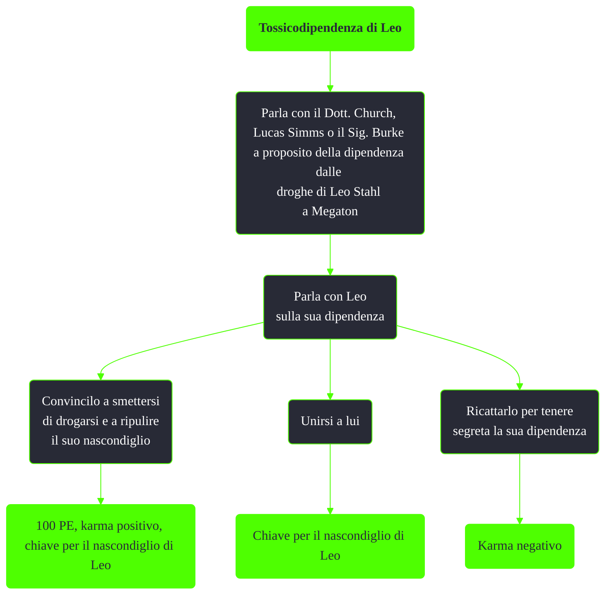

---
# Title, summary, and page position.
linktitle: Tossicodipendenza di Leo
summary: ""
weight: 10
icon: message-question
icon_pack: fas

# Page metadata.
title: Tossicodipendenza di Leo
date: 2022-11-15
type: book # Do not modify.
commentable: true
tags: "Missioni nascoste di Fallout 3"
hidden: true # Visibile nella sidebar
private: false # Nascosto dalle ricerche
---

*Tossicodipendenza di Leo* è una missione nascosta di Fallout 3. È data dal Dott. Church a Megaton.

**Riassunto**:
1. Parla con il Dott. Church, Lucas Simms o il Sig. Burke a proposito della dipendenza dalle droghe di Leo Stahl a Megaton
2. Parla con Leo sulla sua dipendenza
   - Convincilo a smettersi di drogarsi e a ripulire il suo nascondiglio: **100 PE**, **karma positivo**, **chiave per il nascondiglio** di Leo
   - Unisciti a lui: **chiave per il nascondiglio di Leo**
   - Ricattarlo per tenere segreta la sua dipendenza: **karma negativo**

<section class="chart-collapse">
<input type="checkbox" name="collapse2" id="handle2">
<h3 class="handle">
<label for="handle2">Clicca per mostrare il diagramma</label>
</h3>

</section>

**Note**:
- Il nascondiglio di Leo è la scrivania all'interno dell'impianto depurazione acque di Megaton. Contiene diverse droghe e un centinaio di tappi

