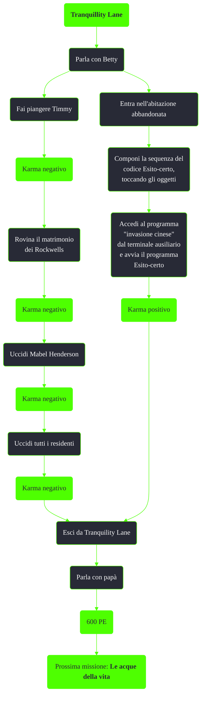

---
# Title, summary, and page position.
linktitle: Tranquillity Lane
summary: ""
weight: 10
icon: messages # message-question per le missioni nascoste
icon_pack: fas

# Page metadata.
title: Tranquillity Lane
date: 2022-11-15
type: book # Do not modify.
commentable: true
tags: "Missioni principali di Fallout 3"
hidden: true # Visibile nella sidebar
private: false # Nascosto dalle ricerche
---

*Tranquillity Lane* è la settima missione principale di Fallout 3. È data dal robocervello al Vault 112, sotto il garage di Smith Casey.

**Riassunto**:
1. Entra in Tranquillity Lane
2. (Opzionale) Entra nell'abitazione abbandonata e componi la sequenza del codice Esito-certo (*vedi* Note): **600 PE**
3. Parla con Betty
4. Fai piangere Timmy: **karma negativo**
5. Rovina il matrimonio dei Rockwells: **karma negativo**
6. Uccidi Mabel Henderson: **karma negativo**
7. Uccidi tutti i residenti: **karma negativo**
8. Esci da Tranquility Lane
9. Parla con papà
10. Ricompensa: **600 PE**
11. Prossima missione: *Le acque della vita*

<section class="chart-collapse">
<input type="checkbox" name="collapse2" id="handle2">
<h3 class="handle">
<label for="handle2">Clicca per mostrare il diagramma</label>
</h3>

</section>

| Tappe |       Stato        | Descrizione                                                                         |
| :---: | :----------------: | ----------------------------------------------------------------------------------- |
|   5   |                    | Trova papà.                                                                         |
|  10   |                    | Trova Betty e parla con lei.                                                        |
|  15   |                    | Fai piangere Timmy Neusbaum.                                                        |
|  20   |                    | Fai un rapporto a Betty.                                                            |
|  25   |                    | Rovina il matrimonio dei Rockwells senza uccidere nessuno dei due.                  |
|  30   |                    | Fai un rapporto a Betty.                                                            |
|  32   |                    | (Facoltativo) Trova e attiva il computer Esito-certo di Tranquility Lane.           |
|  35   |                    | Organizza una morte creativa per Mabel Henderson.                                   |
|  40   |                    | Fai un rapporto a Betty.                                   |
|  45   |                    | Recupera la maschera e il coltello sul lato posteriore dell'Abitazione abbandonata. |
|  50   |                    | Uccidi tutti i residenti di Tranquility Lane.                                       |
|  60   |                    | Fai un rapporto a Betty.                                                            |
|  70   |                    | Esci da Tranquility Lane.                                                           |
|  75   | :white_check_mark: | Parla con papà.                                                                     |

**Note**:
- Il codice di Esito-certo va composto nella casa abbandonata interagendo con gli oggetti, nel seguente ordine: 
	1. la radio rotta
	2. la brocca di vetro
	3. lo gnomo da giardino
	4. la brocca di vetro
	5. il blocco di cemento
	6. lo gnomo da giardino
	7. la bottiglia di soda vuota
	8. Selezionare "invasione cinese" dal terminale ausiliario e avvia il programma Esito-certo

