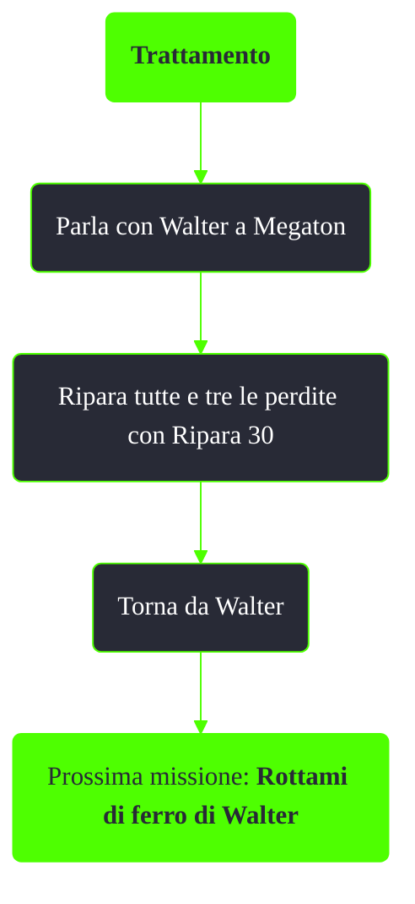

---
# Title, summary, and page position.
linktitle: TODO
summary: ""
weight: 10
icon: message-question
icon_pack: fas

# Page metadata.
title: TODO
date: 2022-11-15
type: book # Do not modify.
commentable: true
tags: "Missioni nascoste di Fallout 3"
hidden: true # Visibile nella sidebar
private: false # Nascosto dalle ricerche
---

*Trattamento* è una missione nascosta di Fallout 3. E' data da Walter a Megaton.

Note:
- Le perdite si trovano:
  - In cima all'edificio dei Figli dell'Atomo
  - Vicino alle scale che portano alla casa a Megaton
  - Vicino al sentiero che porta alla casa comune