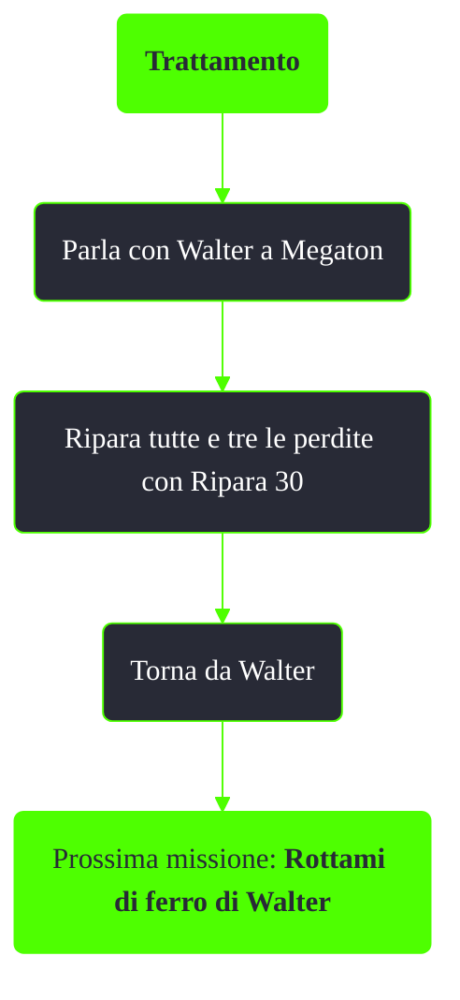

---
# Title, summary, and page position.
linktitle: Trattamento
summary: ""
weight: 10
icon: message-question
icon_pack: fas

# Page metadata.
title: Trattamento
date: 2022-11-15
type: book # Do not modify.
commentable: true
tags: "Missioni nascoste di Fallout 3"
hidden: true # Visibile nella sidebar
private: false # Nascosto dalle ricerche
---

*Trattamento* è una missione nascosta di Fallout 3. È data da Walter a Megaton.

**Riassunto**:
1. Parla con Walter a Megaton
2. Ripara tutte e tre le perdite con Ripara 30
3. Torna da Walter
4. Ricompensa: **100 PE**, **200 tappi**
5. Prossima missione: *Rottami di ferro di Walter*

<section class="chart-collapse">
<input type="checkbox" name="collapse2" id="handle2">
<h3 class="handle">
<label for="handle2">Clicca per mostrare il diagramma</label>
</h3>

</section>

**Note**:
- Le perdite si trovano:
  - In cima all'edificio dei Figli dell'Atomo
  - Vicino alle scale che portano alla casa a Megaton
  - Vicino al sentiero che porta alla casa comune

